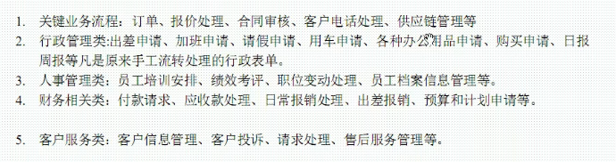

Activiti7
工作流：工作的一个流程，事物发展的一个业务过程
    
    请假：
    
    请假流程：员工申请-----部门经理------总经理------人事存档
    
    传统方式下？ 请假条的传递实现
    
    无纸化办公？ 线上申请------线上审批--------一条请假记录

    在计算机的帮助下，能够实现流程的自动化控制，就称为工作流。实现流程自动化控制

    **工作流的实现方式：**
    
    请假：员工申请-----部门经理------总经理------人事存档
    1，工号，姓名，日期，天数，原因，状态【0，未提交 1，提交】
    
    员工：0未提交 1提交
    
    部门经理：【部门号==部门经理的部门编号相同】
        2同意 3不同意
    总经理：状态==2查询条件
        4同意 5不同意
    人事存档 状态==4
        6同意 7不同意
    
程序员，需要清楚每个状态的意思，缺点不够自动化，业务流程变更之后，程序不能使用

Activiti，就可以是实现业务流程变化后，程序代码不需要改动。

具体应用
