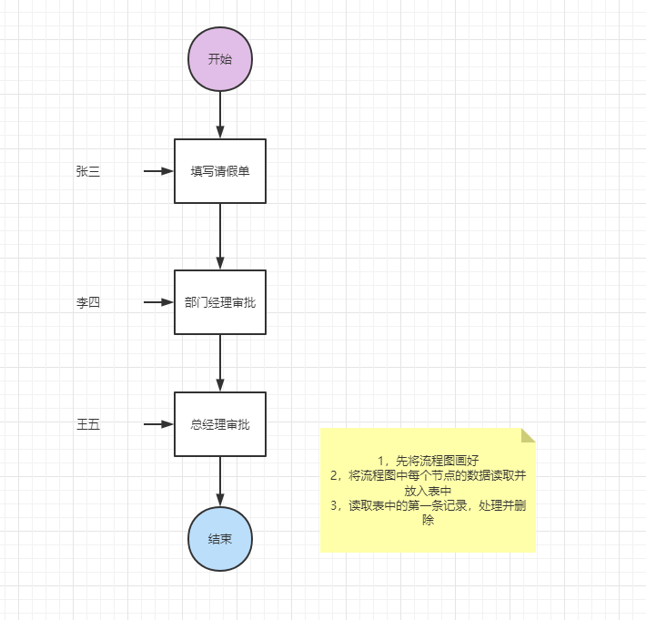

业务流程图本质是一个xml文件，这样就可以存入所要数据

读取业务流程图的过程就是解析xml文件的过程

读取一个业务流程图的结点，就相当于是解析一个xml结点，进一步将数据插入到mysql的表中，形成一条记录

将所有的结点都读取，并存入mysql表中

后面只要读取mysql表中的记录，读一条记录，就相当于读一个结点，读表中的数据，并且处理数据，结束时这一行数据就可以删除

xml+dom4j+mysql+jdbc

