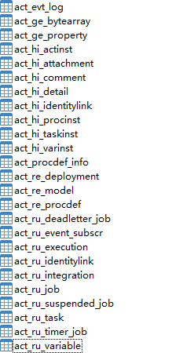

##### 引入pom依赖
```xml
<dependency>
    <groupId>org.activiti</groupId>
    <artifactId>activiti-spring-boot-starter</artifactId>
    <version>7.1.0.M6</version>
</dependency>
```

##### 在test的resources下，新建文件activiti.cfg.xml
```xml
<?xml version="1.0" encoding="UTF-8"?>
<beans xmlns="http://www.springframework.org/schema/beans"
       xmlns:xsi="http://www.w3.org/2001/XMLSchema-instance"
       xsi:schemaLocation="http://www.springframework.org/schema/beans http://www.springframework.org/schema/beans/spring-beans.xsd">

    <bean id="processEngineConfiguration" name="processEngineConfiguration"
          class="org.activiti.engine.impl.cfg.StandaloneProcessEngineConfiguration">
        <property name="jdbcDriver" value="com.mysql.cj.jdbc.Driver"/>
        <property name="jdbcUrl"
                  value="jdbc:mysql://localhost:3306/activiti?useUnicode=true&amp;characterEncoding=utf8"/>
        <property name="jdbcUsername" value="root"/>
        <property name="jdbcPassword" value="password"/>
        <property name="databaseSchemaUpdate" value="true"/>
    </bean>
</beans>
```
ctrl+alt+l reformat代码

shift+F6 重新命名

执行代码，就会在mysql数据库中生成25张表
```java
    @Test
    public void testProcessEngine2(){
        ProcessEngineConfiguration configuration = ProcessEngineConfiguration.createProcessEngineConfigurationFromResource("activiti.cfg.xml");
        ProcessEngine processEngine = configuration.buildProcessEngine();
        System.out.println(processEngine);
    }
```


