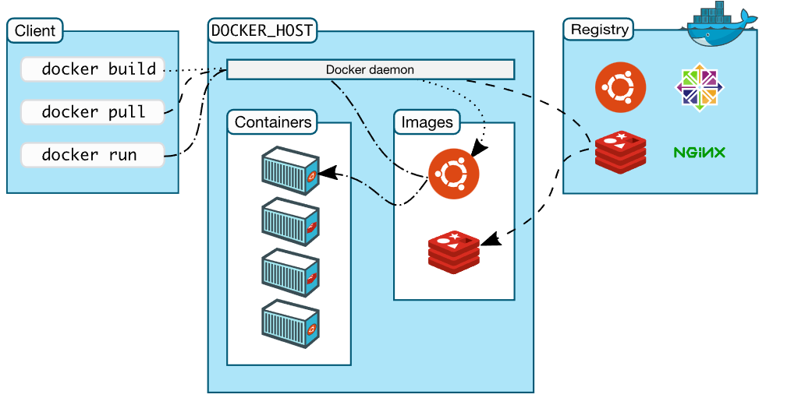

#### 什么是docker？  


docker一个软件，安装在linux系统里面边的，通过docker我可以去下载mysql，reids，mq，很轻松下载。这些被下载叫镜像。docker可以绑定数据卷，可以移植到其他linux机器上。
关键作用：可以在多个环境以相同的配置环境运行。

基于go  
沙箱机制，相互隔离  
有企业版收费，社区版  

#### 安装docker
```java
yum update

yum install -y yum-utils device-mapper-persistent-data lvm2

yum-config-manager --add-repo https://download.docker.com/linux/centos/docker-ce.repo

yum install -y docker-ce

docker -v

systemctl enable docker --now
``` 

#### docker架构

docker daemon:Docker 守护程序 ( dockerd) 侦听 Docker API 请求并管理 Docker 对象，例如图像、容器、网络和卷。守护进程还可以与其他守护进程通信以管理 Docker 服务。  

docker client: Docker 客户端 ( docker) 是许多 Docker 用户与 Docker 交互的主要方式。当您使用诸如docker run之类的命令时，客户端会将这些命令发送到dockerd执行它们。该docker命令使用 Docker API。Docker 客户端可以与多个守护进程通信。  

image:映像是一个只读模板，其中包含创建 Docker 容器的说明。通常，一个图像基于另一个图像，并带有一些额外的自定义。例如，您可以基于该映像构建一个映像ubuntu ，但安装 Apache Web 服务器和您的应用程序，以及使您的应用程序运行所需的配置详细信息。

您可以创建自己的图像，也可以只使用其他人创建并在注册表中发布的图像。要构建您自己的镜像，您需要使用简单的语法创建一个Dockerfile ，用于定义创建和运行镜像所需的步骤。Dockerfile 中的每条指令都会在映像中创建一个层。当您更改 Dockerfile 并重建映像时，仅重建那些已更改的层。与其他虚拟化技术相比，这是使映像如此轻量、小巧和快速的部分原因。  

container:容器是图像的可运行实例。您可以使用 Docker API 或 CLI 创建、启动、停止、移动或删除容器。您可以将容器连接到一个或多个网络，将存储附加到它，甚至可以根据其当前状态创建新映像。

默认情况下，一个容器与其他容器及其主机的隔离相对较好。您可以控制容器的网络、存储或其他底层子系统与其他容器或主机的隔离程度。

容器由其映像以及您在创建或启动它时提供给它的任何配置选项定义。当容器被移除时，任何未存储在持久存储中的状态更改都会消失。  


***

虚拟化技术：
1，基础镜像GB级别
2，创建使用稍微复杂


容器化技术：
1、基础镜像MB级别
3，隔离性强
4，启动速度秒级
5，移植与分享方便
