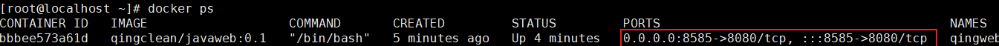

1、docker下载centos镜像，作为配置jdk环境系统
```java
docker pull centos

或者用离线下载的
docker load -i  centos-docker.tar
```

容器基于镜像创建的，执行镜像生成器
docker run
```java
docker run -it --name=c1 -v /usr/local/work/:/mnt/software/ centos /bin/bash
```
参数解析：
　　-i：表示以“交互模式”运行容器
　　-t：表示容器启动后会进入其命令行
　　-v：表示需要将本地哪个目录挂载到容器中，格式：-v <宿主机目录>:<容器目录>
　　/bin/bash：一旦容器启动，需要执行的命令，当前使用 “/bin/bash”, 表示启动后直接进bash shell
　　/usr/local/work/是宿主机器(Linux)上创建的一个文件夹;
　　/mnt/software是centos的容器里面的目录文件
　　这里挂载的意思就是 b36870be5ede 创建的容器访问 /mnt/software/ 目录下的文件就相当于访问 宿主机的 /usr/local/work/下的文件，且两者文件夹里内容相同。

因为使用了/bin/bash，启动后默认进入了容器：
```java
ctrl+d 或者 直接输入 exit
```
再次进去容器
```java
docker exec -it [容器ID] bash
docker exec -it 5d0da3dc9764 bash
```

下载好 tomcat和jdk的 tar包，上传到宿主服务器的/usr/local/work/文件夹下，因为前面做了目录挂载，所以进入docker容器里的/mnt/software/文件夹下也是可以看到宿主机上传的文件：

```java
cd mnt/software/

ls

tar -zxvf jdk-8u211-linux-x64.tar.gz
mv jdk1.8.0_211/ /opt/jdk

```

设置java 环境变量，配置profile
```java
vi /etc/profile
先编辑保存
export JAVA_HOME=/opt/jdk
export CLASSPATH=.:$JAVA_HOME/lib/dt.jar:$JAVA_HOME/lib/tool.jar
export PATH=$PATH:$JAVA_HOME/bin

-----------------
source /etc/profile
```
安装tomcat
```java
#解压文件
tar -zxvf apache-tomcat-8.5.42.tar.gz
#将解压的文件移到新目录
mv apache-tomcat-8.5.42 /opt/tomcat
```
进入tomcat的bin文件夹下，打开setclasspath.sh,最后一行添加
```java
export JAVA_HOME=/op/jdk
export JRE_HOME=/opt/jdk/jre
```

制作镜像
```java
docker commit d31c063183ea qingclean/javaweb:0.1
```
如果在run命令的时候，加了端口映射，就可以ps的看到


```java
docker run -it -p 8585:8080  --name=qingweb1 qingclean/javaweb:0.1 /bin/bash
```
问题就是，还要给正运行的容器，添加数据卷的话，不如，在run的时候，添加好新卷

容器启动失败，查看日志 https://www.csdn.net/tags/NtTaQg3sMzgyNjUtYmxvZwO0O0OO0O0O.html