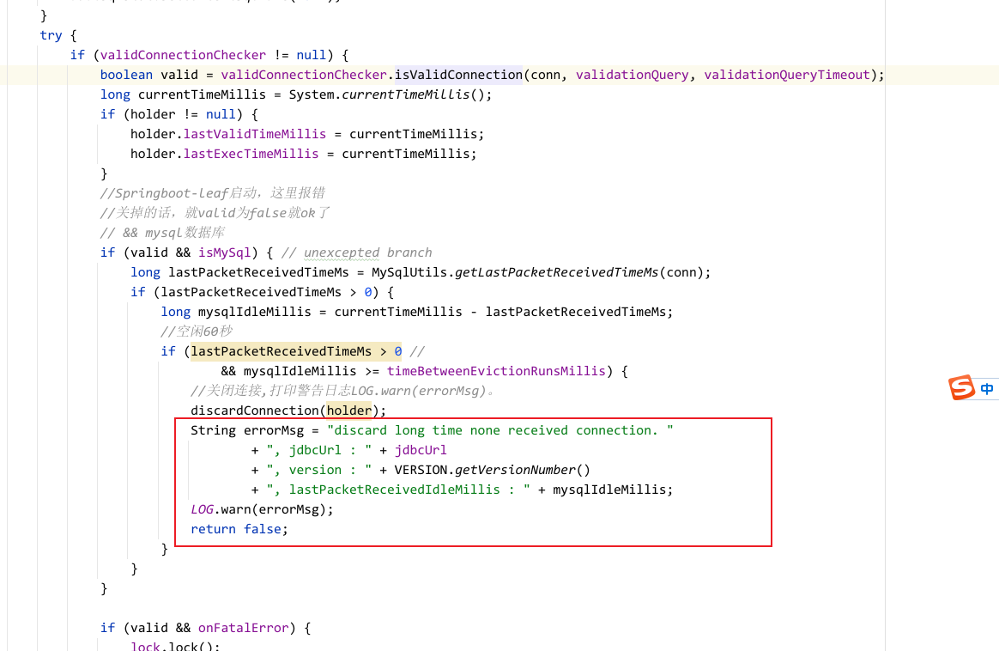
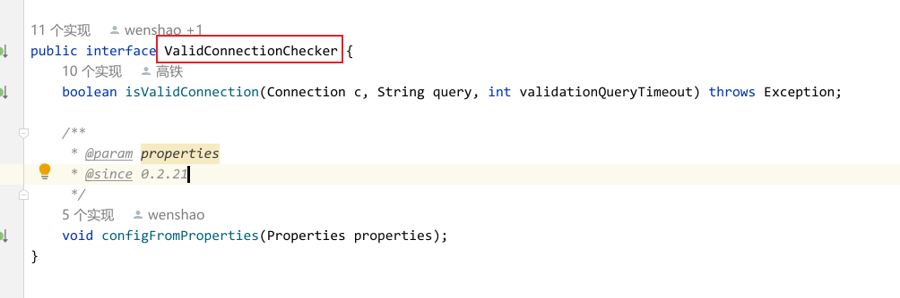
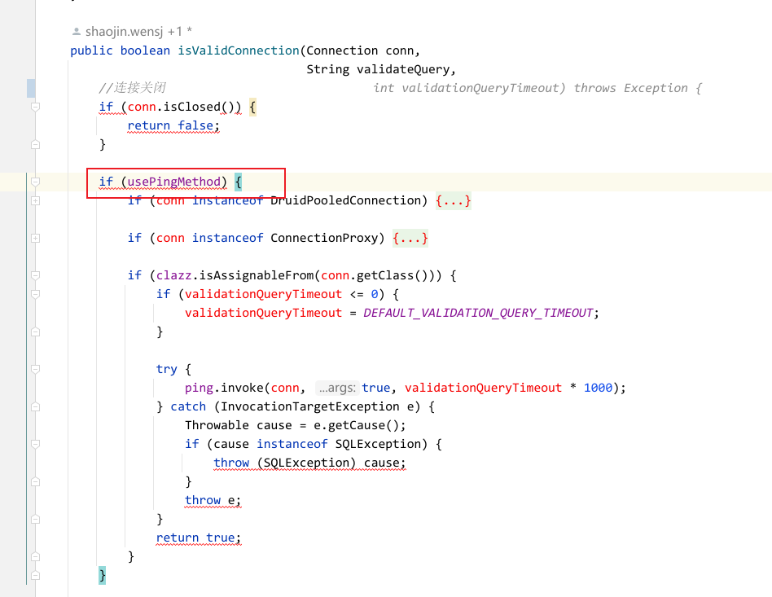

在Springboot集成druid的异常
打包到正式环境报错：discard long time none received connection. , jdbcUrl : jdbc:mysql://******?useSSL=false&allowPublicKeyRetrieval=true&useUnicode=true&characterEncoding=UTF-8, version : 1.2.3, lastPacketReceivedIdleMillis : 172675

还以为是没启动，恼火，结果这是警告日志。不是error  
在1.2.2及以前没有这个异常的，网上是这么说的啊。  

搜索报错，在druid源码中发现：

什么时候会打这个日志呢？

```java
protected volatile long timeBetweenEvictionRunsMillis = DEFAULT_TIME_BETWEEN_EVICTION_RUNS_MILLIS;

public static final long DEFAULT_TIME_BETWEEN_EVICTION_RUNS_MILLIS = 60 * 1000L;
```
看起来是空闲60秒就会打印了。

if条件进来，isMysql一定是true，就看valid的了
```java
boolean valid = validConnectionChecker.isValidConnection(conn, validationQuery, validationQueryTimeout);
```

设置valid为false就好了

找到mysql的实现类


在这个类中发现
```java
    @Override
    public void configFromProperties(Properties properties) {
        if (properties == null) {
            return;
        }
        //关掉这个属性就行了
        //druid.mysql.usePingMethod 设置为false
        String property = properties.getProperty("druid.mysql.usePingMethod");
        if ("true".equals(property)) {
            setUsePingMethod(true);
        } else if ("false".equals(property)) {
            setUsePingMethod(false);
        }
    }
```

那意思就是说在配置druid属性的时候，设置druid.mysql.usePingMethod为false  

```java
static{
    System.setProperty("druid.mysql.usePingMethod","false");
}
```

或者在启动类中java -jar加上
```java
-Ddruid.mysql.usePingMethod=false
```