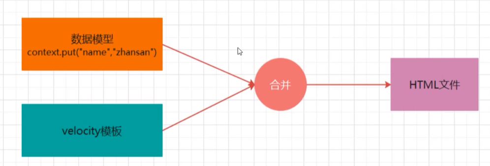

velocity是一个基于java的模板引擎，可以通过特定的语法获取在java对象的数据，填充到模板中，从而实现界面和代码的分离。

velocity目标：写一个CRUD代码生成器。并开源。

#### 应用场景
* Web应用程序：作为应用程序的视图，展示程序
* 源代码生成：Velocity可用于基于模板生成java源代码
* 自动电子邮件：网站注册，认证等的电子邮件模板
* 网页静态化：基于velocity模板，生成静态网页

#### velocity组成结构
app：封装一些接口，给使用者使用，Velocity单例，和VelocityEngine

Context模块：定义变量，如上图context模板渲染变量

Runtime模块：核心模块，加载的模板解析为语法树，Velocity调用mergeTemplate方法时会渲染整颗树，并输出最终的渲染结果

RuntimeInstance：整个Velocity渲染提供一个单例模式，拿到了这个实例就可以完成渲染的过程了。