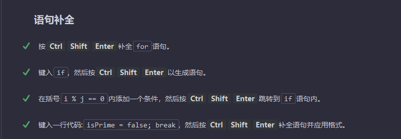

shift+F6 重命名

alt+shift+ 向上箭头|向下箭头 移动代码段

alt+shift+方向键进行上下移动 选中一行移动

选中
```java
ctrl+W 选中单词

double ctrl+w 整个字符串

三次 ctrl+w 在选择中添加引号
```

ctrl+alt+M 提取方法

ctrl+alt+V 提取变量

***
设置收起代码段
ctrl 减号

展开代码区域 ctrl 等号
如果收起文件所有区域ctrl+shift+减号
ctrl shift 等号=展开所有区域
***
idea类型补全

返回类型 ctrl+shift+空格
后缀补全 .



***
快速搜索

ctrl+shift+A

随处搜索 两次shift

缩小搜索范围 ctrl+N

***
把一段代码try catch

选中代码，然后ctrl+alt+T

选中代码段

ctrl+alt+T

ctrl+shift+Delete返回刚才状态

***
代码多选

alt+j 可选择文本光标处的符号
alt+j 双次 可选择下一个匹配项
alt+j+shift 可取消上一次匹配
键入td，替换th所有匹配项

***
复制和删除

ctrl+D 复制文本光标所在行

ctrl+y 删除行
***
快速生成一行配置

ctrl+/ 快速生成一行注释

/** + 回车 我经常用的
***
格式化代码

ctl+Atl+l


***
