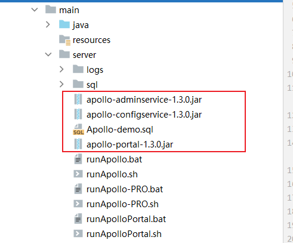
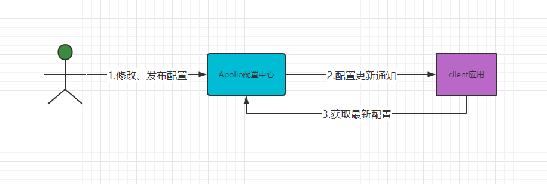
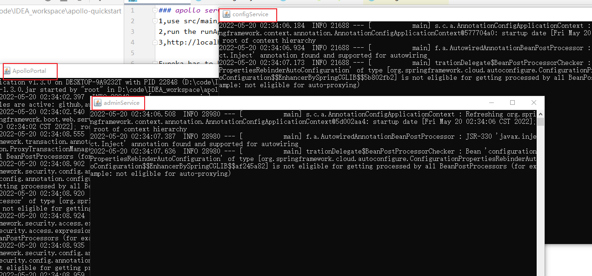
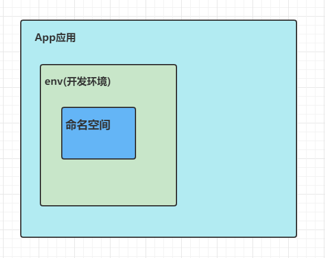

微服务配置中心：高可用，通过eureka进行服务注册与发现。

项目配置，从读文件到读apollo。

配置文件越来越多。新版本发布，

官网：https://www.apolloconfig.com/#/zh/design/apollo-design

架构：client、config-service、admin-service、portal-service、Meta-server（封装用来访问eureka）


Apollo基础模型：用户在管理平台修改了配置，那么配置中心通知Apollo客户端有配置更新，Apollo客户端从配置中心拉取最新的配置、更新本地配置并通知到应用


meta-server：就是把eureka给封装了一下。返回ip端口。
dubbo就是用zk获取ip端口

* config-service：提供配置获取接口、提供配置推送接口、服务于Apollo客户端。[]
admin-service：修改、发布功能。prortal
eureka：提供服务注册和发现，目前eureka部署在config-service一个jvm进程中。
在eureka之上，架了一层meta server用于封装eureka服务发现接口。

流程：在应用启动阶段，Apollo从远端获取配置，然后组装成PropertySource并插入到第一个

server端启动：
java环境：1.8+  
mysql：5.6.5+  
快速启动，就是把这三个jar给启动起来就行了。

访问地址：http://127.0.0.1:8070
用户名、密码：apollo|admin

然后就可以发布应用，创建配置了，巴拉巴拉。

namespace---可以理解为 配置文件 admin.conf mail.conf
appId ------可以理解为 配置文件的一个文件夹webconf、newconf

client端使用：
```xml
<dependency>
    <groupId>com.ctrip.framework.apollo</groupId>
    <artifactId>apollo-client</artifactId>
    <version>1.1.0</version>
</dependency>
```
```java
public static void main(String[] args) {
    Config appConfig = ConfigService.getAppConfig();
    String a = appConfig.getProperty("qq",null);
    System.out.println(a);
}
```
在vm option要指定配置，应用id、环境、注册地址
```xml
//meta的地址注册中心，appid，应用id，evn，环境
-Dapp.id=test1 -Denv=DEV -Ddev_meta=http://192.168.125.101:8080
```
就可以获取到qq的值  ,下面代码测试热发布
```java
while (true){
    a = appConfig.getProperty("qq",null);
    System.out.println(a);
}
```


分布式部署指南：
