```java
<dependency>
    <groupId>org.springframework.cloud</groupId>
    <artifactId>spring-cloud-starter-gateway</artifactId>
</dependency>
```

application.yml配置

```java
server:
  port: 10010

spring:
  application:
    name: gateway

  cloud:
    gateway:
      routes:  #定义路由规则
        - id: ribbon-produce-service   #路由id
          uri: http://localhost:8965  #路由地址 根地址
          predicates:                  #断言规则
            - Path=/produce/**
```

访问地址：<http://localhost:10010/produce/get>
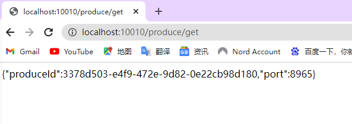

##### 日期时间路由匹配规则

生成时间

```java
ZonedDateTime zonedDateTime = ZonedDateTime.now();//默认时区
//用指定时区获取时间
ZonedDateTime zonedDateTime1 = ZonedDateTime.now(ZoneId.of("Asia/Shanghai"));
System.out.println(zonedDateTime);
System.out.println(zonedDateTime1);
```

匹配指定日期时间之后的请求 After

```java
server:
  port: 10010

spring:
  application:
    name: gateway

  cloud:
    gateway:
      routes:  #定义路由规则
        - id: ribbon-produce-service   #路由id
          uri: http://localhost:8965  #路由地址 根地址
          predicates:                  #断言规则
            - After=2022-06-12T09:35:17.532+08:00[Asia/Shanghai]
```

匹配指定日期时间之前的请求 Before

```java
spring:
  application:
    name: gateway

  cloud:
    gateway:
      routes:  #定义路由规则
        - id: ribbon-produce-service   #路由id
          uri: http://localhost:8965  #路由地址 根地址
          predicates:                  #断言规则
            - Before=2022-06-12T09:35:17.532+08:00[Asia/Shanghai]
```

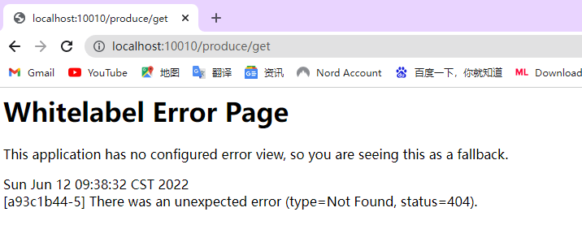

匹配指定日期时间之前的请求 Between

```java
spring:
  application:
    name: gateway

  cloud:
    gateway:
      routes:  #定义路由规则
        - id: ribbon-produce-service   #路由id
          uri: http://localhost:8965  #路由地址 根地址
          predicates:                  #断言规则
            - Between=2022-06-12T09:35:17.532+08:00[Asia/Shanghai],2022-06-12T09:59:17.532+08:00[Asia/Shanghai]
```

##### Cookie路由匹配规则

所述Cookie路由断言工厂采用两个参数，该cookie name和regexp（其是Java正则表达式）。该断言匹配具有给定名称其值与正则表达式匹配的cookie。以下示例配置cookie路由断言工厂：

```java
spring:
  application:
    name: gateway

  cloud:
    gateway:
      routes:  #定义路由规则
        - id: ribbon-produce-service   #路由id
          uri: http://localhost:8965  #路由地址 根地址
          predicates:                  #断言规则
            - Cookie=token, \d+
```

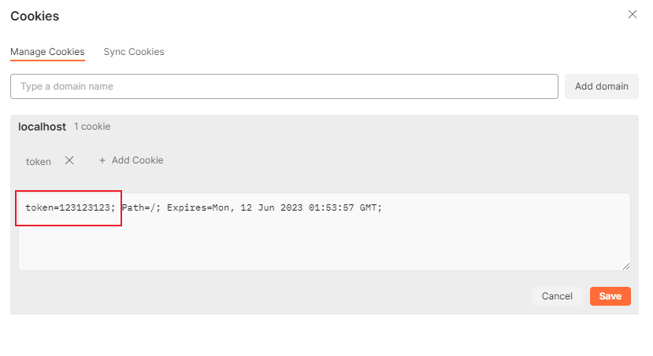

##### Header路由匹配规则

```java
spring:
  application:
    name: gateway

  cloud:
    gateway:
      routes:  #定义路由规则
        - id: ribbon-produce-service   #路由id
          uri: http://localhost:8965  #路由地址 根地址
          predicates:                  #断言规则
            - Header=X-Request-Id, \d+
```

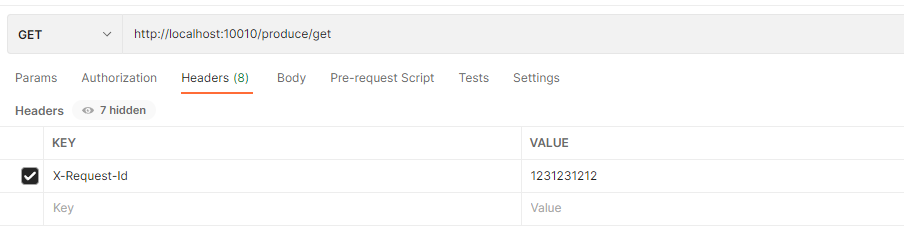

##### Host路由匹配规则

打开hosts文件，加个域名映射本地localhost
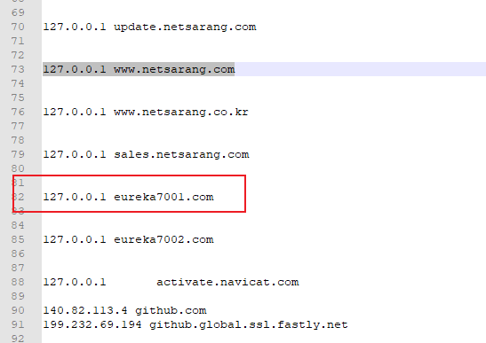

```java
spring:
  application:
    name: gateway

  cloud:
    gateway:
      routes:  #定义路由规则
        - id: ribbon-produce-service   #路由id
          uri: http://eureka7001.com:8965  #路由地址 根地址
          predicates:                  #断言规则
            - Host=**.eureka7001.com
```

##### Method路由匹配规则

```java
server:
  port: 10010

spring:
  application:
    name: gateway

  cloud:
    gateway:
      routes:  #定义路由规则
        - id: ribbon-produce-service   #路由id
          uri: http://localhost:8965  #路由地址 根地址
          predicates:                  #断言规则
            - Method=GET,POST

```

路由匹配请求，如果这个方法GET、POST  

##### Path路由匹配规则

```java
spring:
  application:
    name: gateway

  cloud:
    gateway:
      routes:  #定义路由规则
        - id: ribbon-produce-service   #路由id
          uri: http://localhost:8965  #路由地址 根地址
          predicates:                  #断言规则
            - Path=/produce/{segment}
```

##### Query路由匹配规则
```java
spring:
  application:
    name: gateway

  cloud:
    gateway:
      routes:  #定义路由规则
        - id: ribbon-produce-service   #路由id
          uri: http://localhost:8965  #路由地址 根地址
          predicates:                  #断言规则
            - Query=green
```
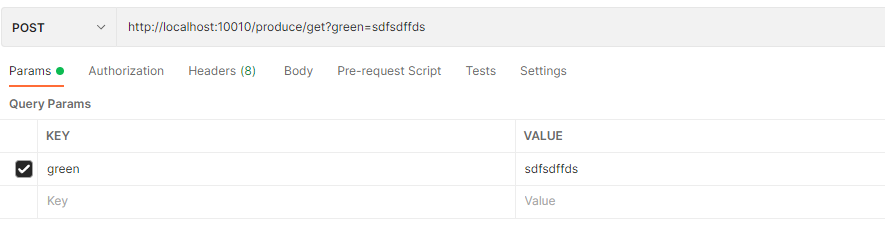

##### Weight路由匹配规则
```java
spring:
  application:
    name: gateway

  cloud:
    gateway:
      routes:  #定义路由规则
        - id: ribbon-produce-service1   #路由id
          uri: http://localhost:8965  #路由地址 根地址
          predicates:                  #断言规则
            - Weight=group1, 8
        - id: ribbon-produce-service2
          uri: http://localhost:8964
          predicates:
            - Weight=group1, 2
```
这条路线会将大约80%的流量转发到8965端口，20%到8964端口

#### Gateway过滤器
* pre过滤器在请求转发到后端微服务之前执行，在Pre类型过滤器中可以做鉴权、限流等操作。
* post过滤器在请求执行完成之后、将结果返回给客户端之前执行。
在SpringCloud Gateway中内置很多Filter，Fitler有两种实现，GatewayFilter和GlobalFilter。GlobalFilter全局过滤器会应用到所有的路由上，而GatewayFilter只会应用到单个路由或者一个分组的路由上。

##### 前置处理器 AddRequestParameter GatewayFilter
```java
spring:
  application:
    name: gateway

  cloud:
    gateway:
      routes:  #定义路由规则
        - id: ribbon-produce-service1   #路由id
          uri: http://localhost:8965  #路由地址 根地址
          predicates:                  #断言规则
            - Path=/produce/**
          filters:
            - AddRequestParameter=info, hehe
```
```java
@RequestMapping("/produce/get")
public String getProduce(String info){
    System.out.println(info);
    return "{\"produceId\":"+ UUID.randomUUID() +",\"port\":"+port+"}";
}
```
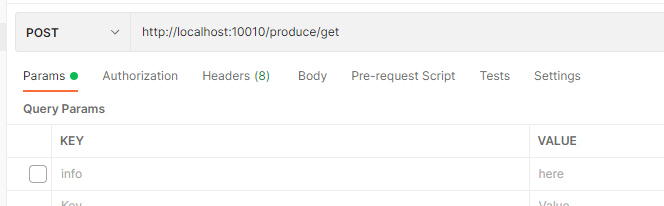
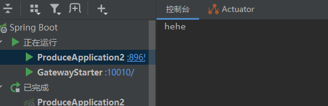

##### 前置处理器 RewritePath GatewayFilter
```java
spring:
  application:
    name: gateway

  cloud:
    gateway:
      routes:  #定义路由规则
        - id: ribbon-produce-service1   #路由id
          uri: http://localhost:8965  #路由地址 根地址
          predicates:                  #断言规则
            - Path=/produce/**, /api-gateway/**
          filters:
            - AddRequestParameter=info, hehe
            - RewritePath=/api-gateway(?<segment>/?.*), $\{segment}
```
将/api-gateway/produce请求重写成/produce/请求（属于前置过滤网关）  
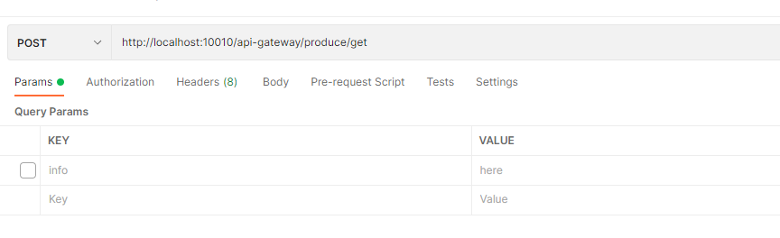

##### 后置处理器 SetStatus GatewayFilter
```java
spring:
  application:
    name: gateway

  cloud:
    gateway:
      routes:  #定义路由规则
        - id: ribbon-produce-service1   #路由id
          uri: http://localhost:8965  #路由地址 根地址
          predicates:                  #断言规则
            - Path=/produce/**, /api-gateway/**
          filters:
            - AddRequestParameter=info, hehe
            - RewritePath=/api-gateway(?<segment>/?.*), $\{segment}
            - SetStatus=456
```
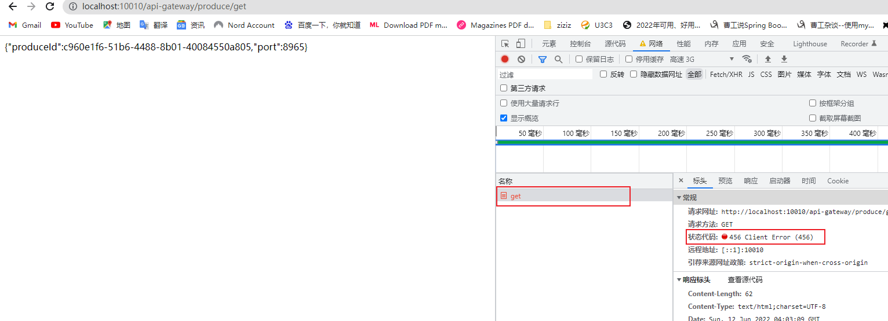

##### 后置处理器 AddResponseHeader GatewayFilter
```java
spring:
  application:
    name: gateway

  cloud:
    gateway:
      routes:  #定义路由规则
        - id: ribbon-produce-service1   #路由id
          uri: http://localhost:8965  #路由地址 根地址
          predicates:                  #断言规则
            - Path=/produce/**, /api-gateway/**
          filters:
            - AddRequestParameter=info, hehe
            - RewritePath=/api-gateway(?<segment>/?.*), $\{segment}
            - SetStatus=456
            - AddResponseHeader=X-Response-Red, Blue
```
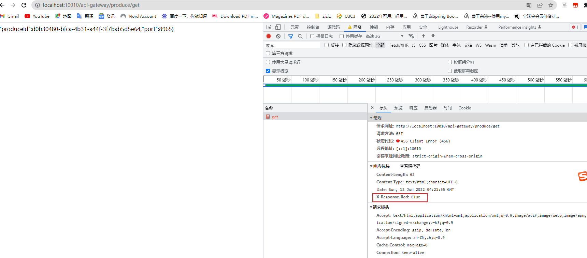

#### 全局过滤器GlobalFilter
全局过滤器不需要在配置文件中配置，作用在所有的路由上。我们可以用它来实现很多统一化处理的业
务需求，比如负载均衡，统一过滤，路径转发，监控，日志等等。
全局过滤器加上网关过滤器组成过滤器链，该过滤器链的执行顺序是根据@Order注解指定的数字大
小，从小到大进行排序，数字越小，优先级越高。

**把yml配置去掉，不然会覆盖**
自定义网关过滤器
```java
public class MyCustomerGatewayFilter implements GatewayFilter, Ordered {
    @Override
    public Mono<Void> filter(ServerWebExchange exchange, GatewayFilterChain chain) {
        System.out.println("自定义网关过滤器");
        System.out.println(exchange.getRequest().getRemoteAddress());
        return chain.filter(exchange);
    }

    @Override
    public int getOrder() {
        return -1;
    }
}
```
```java
@Configuration
public class FilterConfig {

    @Bean
    public RouteLocator routeLocator(RouteLocatorBuilder builder){
        return builder.routes().route(r->r
                .path("/produce/**")
                .uri("http://localhost:8965/**")
                .filter(new MyCustomerGatewayFilter())
                .id("myCustomGateway")
        ).build();
    }
}
```
请求地址：http://localhost:10010/produce/get
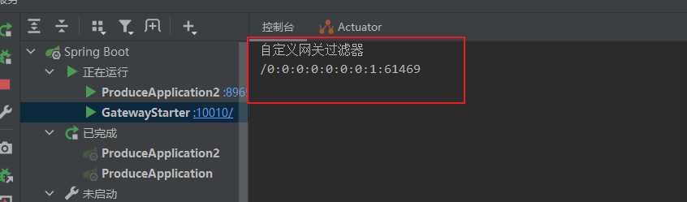

自定义全局过滤器
没有绑定其他路由，直接把filter注入到spring容器中
```java
@Component
public class MyGlobalFilter implements GlobalFilter, Ordered {
    @Override
    public Mono<Void> filter(ServerWebExchange exchange, GatewayFilterChain chain) {
        System.out.println("自定义全局过滤器");
        return chain.filter(exchange);
    }

    @Override
    public int getOrder() {
        return -10;
    }
}
```
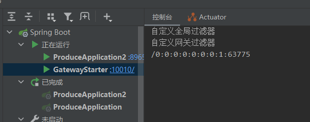

