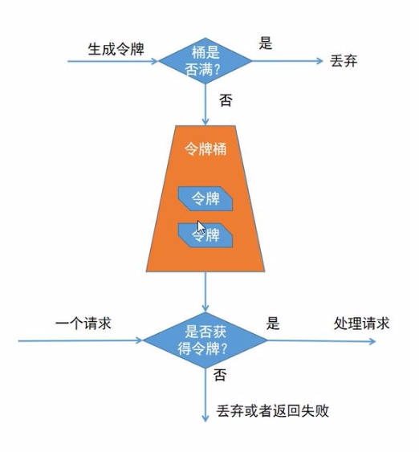
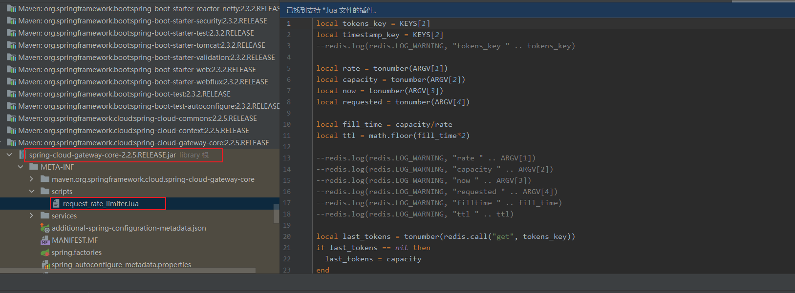
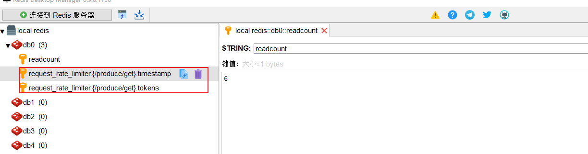

gateway提供了默认限流，RequestRateLimiter



```java
spring:
  application:
    name: gateway

  cloud:
    gateway:
      routes:  #定义路由规则
        - id: ribbon-produce-service1   #路由id
          uri: http://localhost:8965  #路由地址 根地址
          predicates:                  #断言规则
            - Path=/produce/**, /api-gateway/**
          filters:
            - name: RequestRateLimiter #限流器
              args:
                redis-rate-limiter.replenishRate: 1 #令牌桶每秒填充速率
                redis-rate-limiter.burstCapacity: 2 #令牌桶总容量
                redis-rate-limiter.requestedTokens: 1 #一个请求需要消费的令牌数
                key-resolver: "#{@pathKeyResolver}"
  redis:
    host: localhost
    port: 6379
    connection-timeout: 10s
    lettuce:
      pool:
        max-active: 8 #连接池最大连接数 默认 8
        max-wait: 200s #连接池最大阻塞等待时间 默认-1
        max-idle: 8 #连接池中最大空闲数 默认8
        min-idle: 0 #连接池中最小空闲数 默认0
```

```java
@Configuration
public class KeyResolverConfiguration {

    @Bean
    public KeyResolver pathKeyResolver(){
        return exchange -> Mono.just(exchange.getRequest().getURI().getPath()); //URI限流
    }
}
```
访问地址：http://localhost:10010/produce/get

