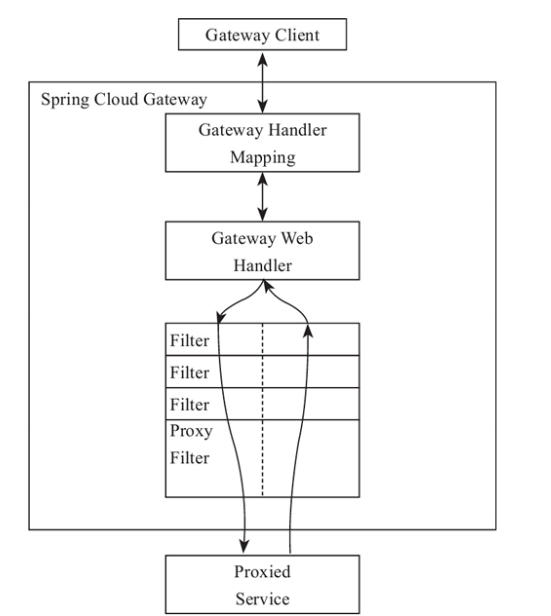
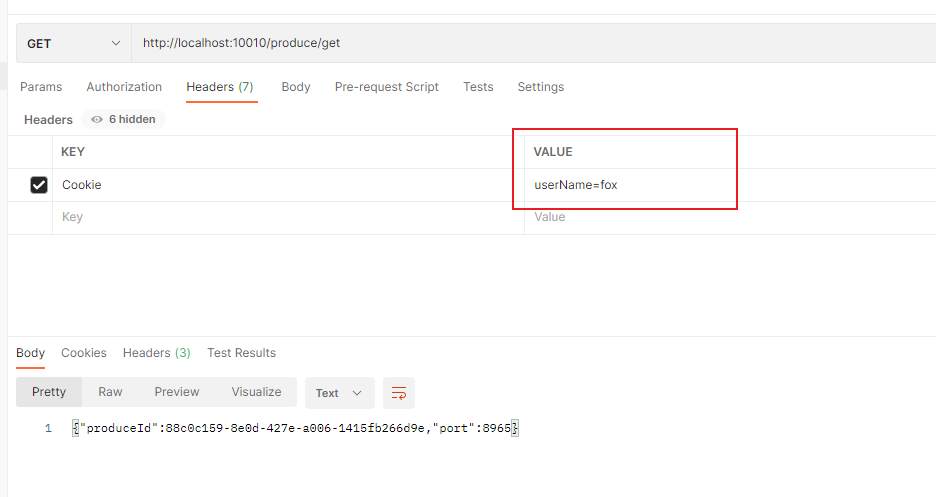
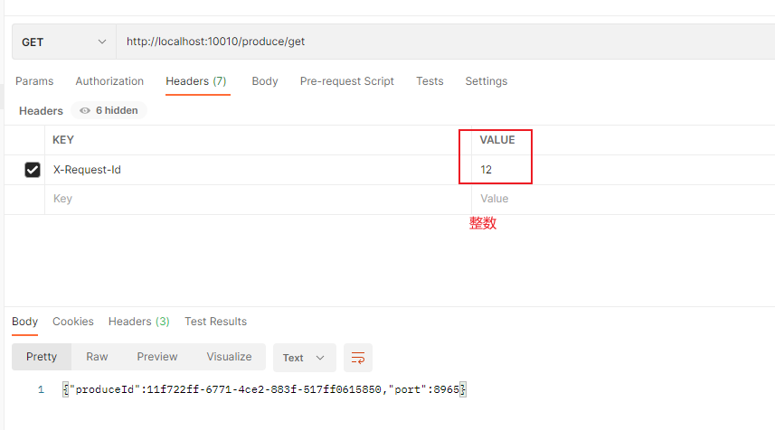

spring Cloud Gateway是Spring官方基于Spring 5.0，Spring Boot 2.0和Project Reactor等技术开发的网关，Spring Cloud Gateway旨在为微服务架构提供一种简单而有效的统一的API路由管理方式。Spring Cloud Gateway作为Spring Cloud生态系中的网关，目标是替代ZUUL，其不仅提供统一的路由方式，并且基于Filter链的方式提供了网关基本的功能，例如：安全，监控/埋点，和限流等。

maven依赖
```java
<dependency>
    <groupId>org.springframework.cloud</groupId>
    <artifactId>spring-cloud-starter-gateway</artifactId>
</dependency>
```

因为spring cloud gateway是基于webflux的，如果非要web支持的话需要导入spring-boot-starter-webflux而不是spring-boot-start-web，会冲突。

最简单的使用
```java
spring:
  cloud:
    gateway:
      routes:
        - id: user-service
          uri: http://localhost:8965/
          predicates:
          - Path=/produce/get
```
访问路径 http://localhost:10010/produce/get
跳转到 http://localhost:8965/produce/get

#### 概念
* 路由（route）
    网关最基础的部分，路由信息包括一个ID，一个目的的URI，一组断言工厂，一组filter组成，如果断言为真，则说明请求的URL和配置的路由匹配。
* 断言（predicates）
    Java8中的断言函数，SpringCLoud Gateway中的断言函数类型是Spring5.0中ServerWebExchange.断言函数允许开发者去定义匹配Http request中的任何信息，比如请求头和参数。 
* 过滤器（Filter）
    Gateway分为Gateway Filter和Global Filter。Filter可以对请求和响应进行处理

#### 工作原理
Gateway的工作原理和zuul差不多，最大的区别就是Gateway的Filter只有pre和post两种。

如果请求与网关程序的路由匹配，则该请求就会被发送到网关Web处理程序，此时处理程序运行特定的请求过滤器链。
过滤器之间用虚线分开的原因是可能会在发送代理请求的前后执行逻辑。所有pre过滤器先执行，代理请求执行完成后，执行post过滤器逻辑

#### after匹配
拦截在after之后的请求，发送到目标uri里面去.在这个时间之前发送的请求都404找不到
生成ZonedDateTime类型的数据
```java
ZonedDateTime zonedDateTime = ZonedDateTime.now();//默认时区
//用指定时区获取时间
ZonedDateTime zonedDateTime1 = ZonedDateTime.now(ZoneId.of("Asia/Shanghai"));
System.out.println(zonedDateTime);
System.out.println(zonedDateTime1);
```

```java
spring:
  application:
    name: gateway

  cloud:
    gateway:
      routes:
        - id: user-service
          uri: http://localhost:8965/produce/get
          predicates:
#          - Path=/produce/get
            # 匹配在指定的日期时间之后发生的请求 入参是ZonedDateTime类型
          - After=2022-05-28T03:30:46.136+08:00[Asia/Shanghai]
```


#### cookie匹配

```java
- id: cookie-service
  uri: http://localhost:8965
  predicates:
    - Cookie=userName, fox
```
访问url：http://localhost:10010/produce/get

#### Header匹配
```java
- id: cookie-service
  uri: http://localhost:8965
  predicates:
#            - Cookie=userName, fox
    - Header=X-Request-Id, \d+
```


#### 路径匹配
```java
- id: cookie-service
  uri: http://localhost:8965
  predicates:
#            - Cookie=userName, fox
#            - Header=X-Request-Id, \d+
    - Path=/produce/**
```

