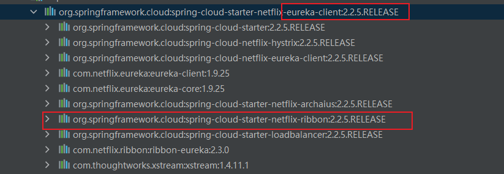
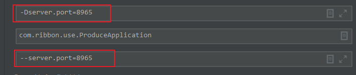

application client会从Eureka中根据spring.application.name加载application service的列表。根据设定的负载均衡算法，从列表中取出一个URL，到此Ribbon的事情结束了。剩下就是由程序员自己进行技术选型，RestTemplate或者HttpClient

只有application client从eureka中取出列表后进行负载均衡算法的过程和ribbon有关

集中式负载均衡和进程内负载均衡

集中式负载均衡：（nginx和f5）

进程内：ribbon，dubbo

引入client，就拉入了ribbon依赖

作用相同：上面是vm参数，下面是程序参数  
-D == --

 