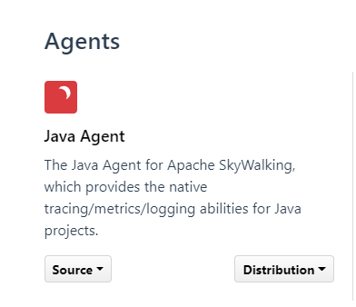
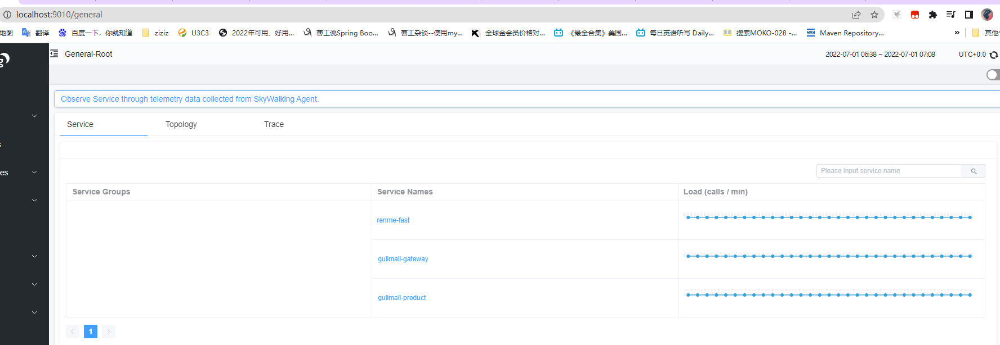
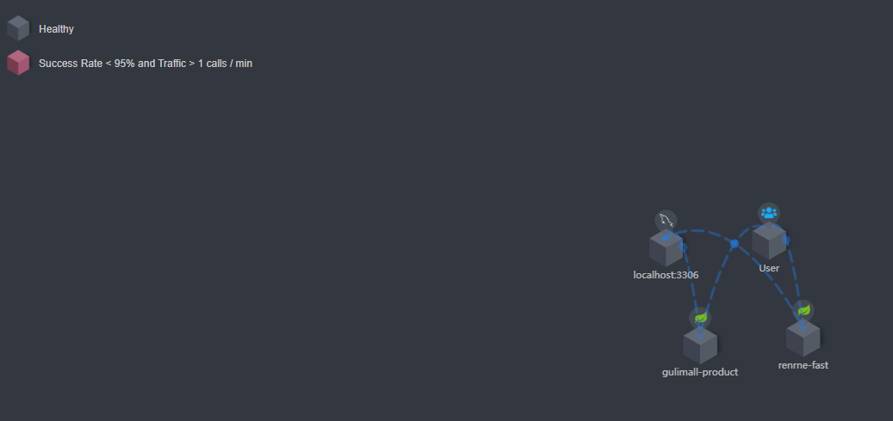

支持rpc监控

dubbo
dubbox

##### springboot集成-http

1. 在官网下载java-agent组件 <https://skywalking.apache.org/downloads/>


2. 在需要集成的springboot项目中，添加vm参数
```java
-javaagent:D:/skywalking/skywalking-agent/skywalking-agent.jar
-Dskywalking_config=D:/skywalking/skywalking-agent/config/agent.config
-Dskywalking.collector.backend_service=192.168.125.101:11800
-Dskywalking.agent.service_name=gulimall-gateway
```


3. 在apm项目启动之前，还需要配置，微服务的网关ip端口
D:\skywalking\apache-skywalking-apm-bin\config\gateways.yml

```java
gateways:
 - name: proxy0
   instances:
     - host: 192.168.125.101 # the host/ip of this gateway instance
       port: 88 # the port of this gateway instance, defaults to 80
```
