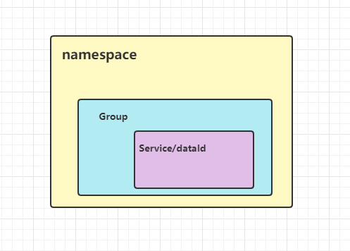

Nacos数据模型Key由三元组唯一确定，Namespace默认是空串，公共命名空间（public），分组默认是DEFAULT_GROUP  

[Namespace[Group[Service/DataId]]]


对应的配置文件
```java
#命令空间-按环境
spring.cloud.nacos.config.namespace=dev
#分组-按具体项目
spring.cloud.nacos.config.group=DEFAULT_GROUP
#配置文件名称
spring.cloud.nacos.config.name=ribbon-produce.properties
```


图中红框是namespace的值，填dev是不行的