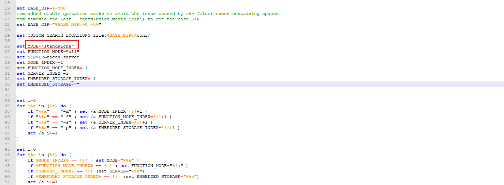

#### windows单机启动
默认nacos-server是cluster模式，要改成standalone




访问地址：http://127.0.0.1:8848/nacos/#/login

用户名密码：nacos|nacos

修改内置数据库为mysql

在conf文件夹下，application.properties

```java
db.url.0=jdbc:mysql://127.0.0.1:3306/nacos?characterEncoding=utf8&connectTimeout=1000&socketTimeout=3000&autoReconnect=true&useUnicode=true&useSSL=false&serverTimezone=UTC
db.user.0=root
db.password.0=password
```

客户端引入依赖
```java
<dependency>
    <groupId>com.alibaba.cloud</groupId>
    <artifactId>spring-cloud-starter-alibaba-nacos-discovery</artifactId>
</dependency>

<dependency>
    <groupId>com.alibaba.cloud</groupId>
    <artifactId>spring-cloud-starter-alibaba-nacos-config</artifactId>
</dependency>
```