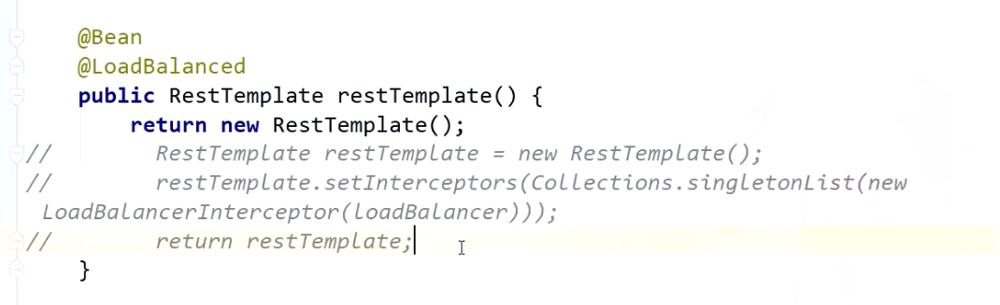
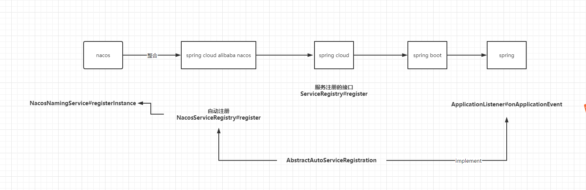

主要功能：
1. 动态配置服务
1. 服务发现与管理
1. DNS


CS架构。

在start.cmd里面把集群模式改成standlone

启动端口是8848

把服务拉到本地来，是有一个接口的：openapi
```java
/nacos/v1/ns/service/list
```

注册instance是什么存储的？ 临时节点存在内存 持久节点持久化到磁盘文件 data/naming/namespace的id    
配置数据是什么存储的  derby mysql

nacos集群：会相互同步服务实例，保证服务的一致性，raft协议，CP，有一个leader

nacos：拉取 持久实例和临时实例是一次性拉取的  
naming-server【namingservice】：注册服务

心跳：服务续约，客户端向服务端定时发心跳，服务端接收到心跳后修改服务的续约时间
lastregistrytime：  
9:00 15s  
9:15 15s  
服务端服务剔除：  
currenttime-lastregistrytime>15s 修改存活状态 down  

currenttime-lastregistrytime>15s delete  

阈值保护   down(的节点数量)/all(的节点数量) < 阈值  

上传到linux服务器。然后以standalone模式启动，然后在rabbon的项目里，集成nacos-client。然后去调用访问。
启动nacos-server的命令
```java
bin/startup.sh ‐m standalone
```
nacos的数据库文件：nacos-mysql.sql  

在RestTemplate扩展点里面有一个接口，ClientHttpRequestInterceptor    
Ribbon是实现了这个扩展，LoadBalancerInterceptor实现这个扩展点  
mall-order --------> localhost:8020 
http://mail-order -----------> localhost:8020  


服务实例内部注册表  
Map(namespace,Map(gourp::serviceName,Service))
namespace: 隔离的作用  
group:serviceName: 隔离作用 group 所有服务用同一个gourp   （配置中心，起到环境隔离的作用）

Service #就是一个微服务  
Map<String,Cluster> clusterMap #集群 BJ SH（ribbon 负责均衡算法：优先使用同一集群的节点）

private Set<Instance> persistenInstances = new HashSet<Instance>();  #持久实例  
private Set<Instance> ephemeralInstances = new HashSet<Instance>();  #临时实例  
临时实例，存到内存
持久实例，存到磁盘


