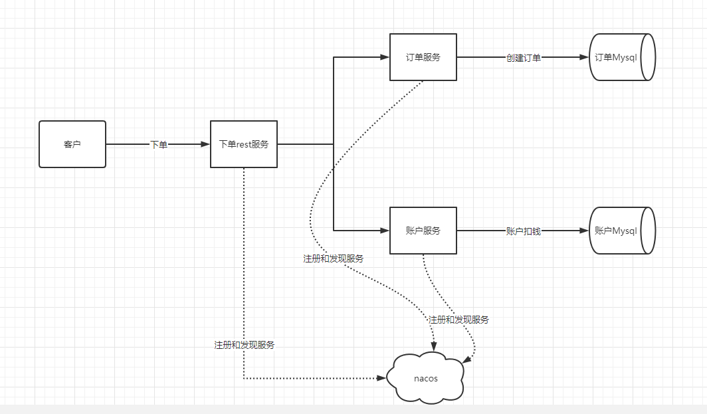

#### 分布式事务ACID

A:原子性，构成事务的所有操作，要么都执行完成，要么全部不执行，不可能出现部分成功部分失败的情况。
C:一致性，在事务执行前后，数据库的一致性约束没有被破坏。比如：张三向李四转100元，转账前和转账后的数据是正确状态这叫一致性。
I:隔离性，数据库的事务一般是并发，并发的事务互不干扰。
D:持久性，事务完成，不会回滚。

不同的服务之间通过网络远程协作完成事务称之为分布式事务，例如用户注册送积分事务、创建订单减库存事务，银行转账事务等都是分布式事务。  

#### 案例搭建

模拟一个简单下单业务，客户端调用rest对外服务，rest服务再调用订单服务实现创建订单和账户服务实现账户扣钱操作，最终来完整下单业务；

##### 架构设计



seata-server的1.4.2版本，file.conf添加配置
```yml
service {
  #vgroup -> rgroup 服务分组 集群分组默认为 "default"
  vgroupMapping.my_test_tx_group = "default"
  #only support single node
  default.grouplist = "127.0.0.1:8091"
  #degrade current not support 服务降级达到多次错误不走seata
  enableDegrade = false
  #disable
  disable = false
  #unit ms, s, m, h, d represents milliseconds, seconds, minutes, hours, days,
  default permanent
  max.commit.retry.timeout = "-1"
  max.rollback.retry.timeout = "-1"
}
```
