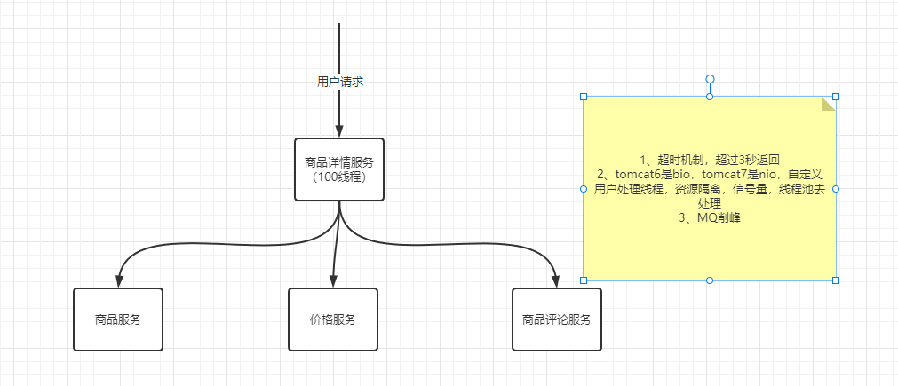

定时任务
@RefreshScope  会把bean干掉，定时器也会被干掉，beanFactory，后置处理器，删除，再去获取是懒加载的。

链路调用，一个服务不可用，导致我们整个链路不可用，导致整个服务不可用。

早起Netflix提供的方案（hystrix）

服务熔断：hystrix是这么实现的。  

sentinel通过两种手段：
* 通过并发线程数进行限制  
* 通过响应时间对资源进行降级  

sentinel基本概念：
**资源**
资源是Sentinel的关键概念。它可以是Java应用程序的任何内容，  
只要通过Sentinel API 定义的代码，就是资源，能够被Sentinel保护起来。大部分情况下，可以使用方法签名，URL，甚至服务名称作为资源名来标示资源。  
在Sentinel里面，所有资源对应一个资源名称（resourceName），每次资源调用都会创建一个Entry对象，

**规则**
围绕资源的实时状态设定的规则，可以包括流量控制规则、熔断降级规则以及系统保护规则。所有规则可以动态实时调整。

关键步骤：  
1、定义资源  
2、定义规则  
3、校验规则是否有效  

结合AOP去使用，就像springsecurity结合aop和权限校验在controller的method上。

tomcat可以结合filter，springmvc的结合interceptor  

SentinelResource去用spring的aop去实现的。  

#### 代码实现
##### 1、Sentinel的API实现

##### 2、注解的方式去做@SentinelResource