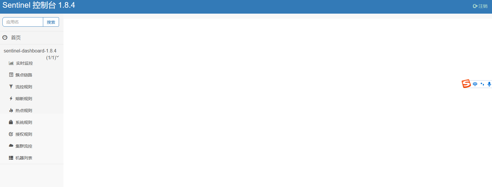
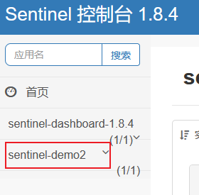
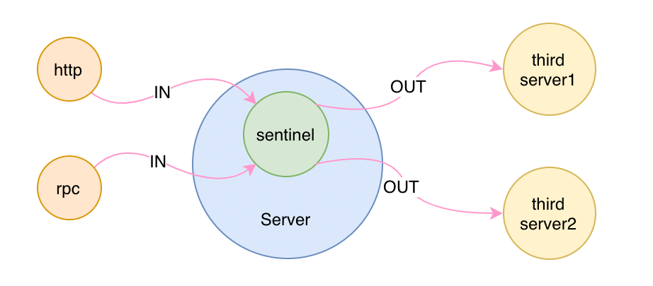
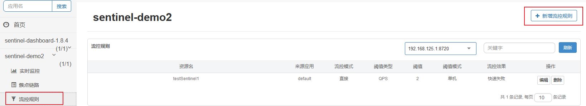
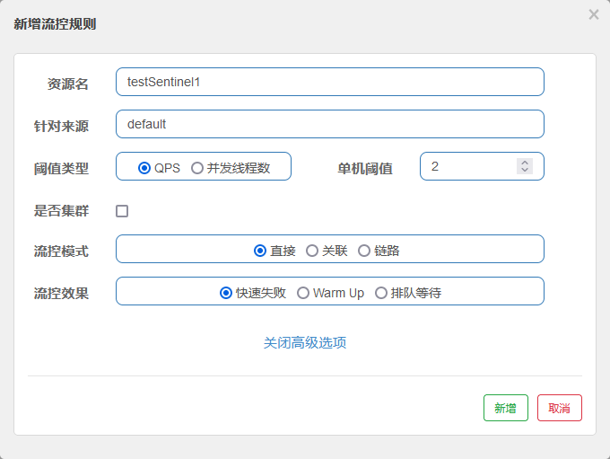
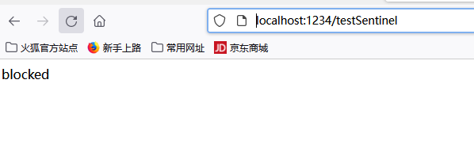
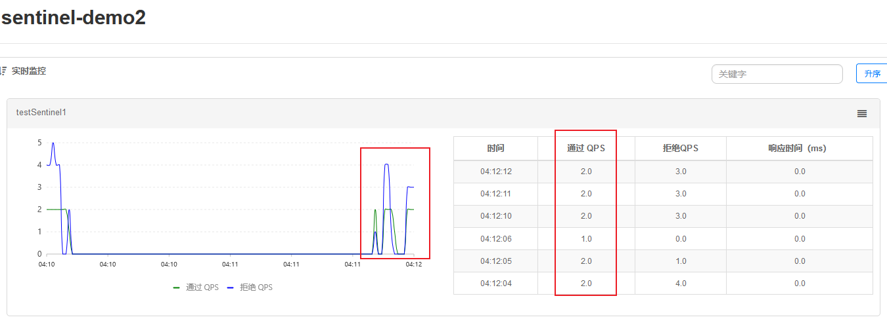

##### 启动控制台
在目录下，输入cmd，再输入启动命令
C:\Windows\System32\cmd.exe
```java
java -Dserver.port=8080 -Dcsp.sentinel.dashboard.server=localhost:8080 -jar sentinel-dashboard-1.8.4.jar
```

访问地址：http://localhost:8080/#/dashboard
用户名：sentinel
密码：sentinel

界面展示：


接入控制台，maven依赖：
```java
<dependency>
    <groupId>com.alibaba.csp</groupId>
    <artifactId>sentinel-transport-simple-http</artifactId>
    <version>1.8.4</version>
</dependency>
```

在应用启动之前，在vm参数添加：
```java
-Dproject.name=xxx -Dcsp.sentinel.dashboard.server=consoleIp:port
```
启动sentinel-demo2，访问地址：http://localhost:1234/testSentinel
触发客户端连接控制台


PS：这里有个需要注意的知识点，就是 SphU.entry 方法的第二个参数 EntryType 说的是这次请求的流量类型，共有两种类型：IN 和 OUT 。

IN：是指进入我们系统的入口流量，比如 http 请求或者是其他的 rpc 之类的请求。

OUT：是指我们系统调用其他第三方服务的出口流量。

入口、出口流量只有在配置了系统规则时才有效。



添加流控规则：



然后我们不停的刷新访问地址，会出现blocked


然后实时监控显示
