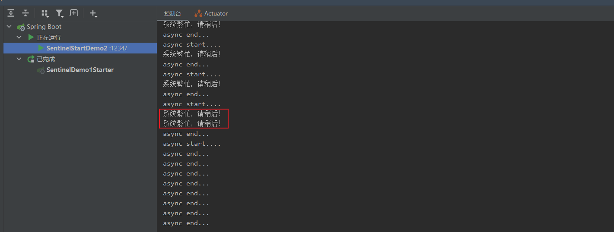

##### 启动控制台
在目录下，输入cmd，再输入启动命令
C:\Windows\System32\cmd.exe
```java
java -Dserver.port=8080 -Dcsp.sentinel.dashboard.server=localhost:8080 -jar sentinel-dashboard-1.8.4.jar
```

访问地址：http://localhost:8080/#/dashboard
用户名：sentinel
密码：sentinel

界面展示：


接入控制台，maven依赖：
```java
<dependency>
    <groupId>com.alibaba.csp</groupId>
    <artifactId>sentinel-transport-simple-http</artifactId>
    <version>1.8.4</version>
</dependency>
```

在应用启动之前，在vm参数添加：
```java
-Dproject.name=xxx -Dcsp.sentinel.dashboard.server=consoleIp:port
```
启动sentinel-demo2，访问地址：http://localhost:1234/testSentinel
触发客户端连接控制台


PS：这里有个需要注意的知识点，就是 SphU.entry 方法的第二个参数 EntryType 说的是这次请求的流量类型，共有两种类型：IN 和 OUT 。

IN：是指进入我们系统的入口流量，比如 http 请求或者是其他的 rpc 之类的请求。

OUT：是指我们系统调用其他第三方服务的出口流量。

入口、出口流量只有在配置了系统规则时才有效。


添加流控规则：


然后我们不停的刷新访问地址，会出现blocked


然后实时监控显示


#### 控制台设置限流规则


#### 抛出异常的方式定义资源
SphU包含了try-catch风格的API，用这种方式，当资源发生限流之后会抛出BlockException，这个时候可以捕捉异常，进行限流之后的逻辑处理
```java
 try(Entry entry=SphU.entry("resourceName")){
    //被保护的业务逻辑
}catch (BlockException e){
    //资源访问阻止，被限流或被降级
    //在此处进行相应的处理操作
}
```

SphU提供if-else风格的api，用这种方式，当资源发生了限流之后会返回false，这个时候根据返回值，进行限流之后的逻辑处理。示例代码如下：
```java
//资源名可使用任意有业务语义的字符串
if(SphO.entry("自定义资源名")){
    try{
    //被保护的业务逻辑    
    }finally{
        SphO.exit();
    }
}else{
    //资源访问阻止，被限流或被降级
    //进行相应的处理操作
}
```
SphO.entry()和 SphO.exit(),必须成对出现

##### 注解定义资源
引入sentinelResource注解用于定义资源，提供AspectJ的扩展用于自定义资源，处理BlockException，使用
```java
<dependency>
    <groupId>com.alibaba.csp</groupId>
    <artifactId>sentinel-annotation-aspectj</artifactId>
    <version>1.8.4</version>
</dependency>
```
使用sprincloud alibaba，就不用了。

注入SentinelResourceAspect这个bean对象。
```java
@Configuration
public class SentinelAspectConfiguration {

    @Bean
    public SentinelResourceAspect sentinelAspectConfiguration(){
        return new SentinelResourceAspect();
    }
}

```
controller测试方法
```java
    @SentinelResource(value = "testSentinel3",blockHandler = "blockHandlerForHelloWorld13")
    @GetMapping("/testSentinel3")
    @ResponseBody
    public String testSentinel3(){
        return "testSentinel3:"+System.currentTimeMillis();
    }
    
    @ResponseBody
    public String blockHandlerForHelloWorld13(BlockedException exception){
        exception.printStackTrace();
        return "系统繁忙！";
    }
```
##### 异步调用支持
Sentinel支持异步调用链路的统计，在异步调用中，需要通过SphU.asyncEntry(xxxxx)方法定义范围，并通过需要在异步的回调函数中调用
exit方法。
第一步：启动类加注解@EnableAsync，让项目支持异步调用
```java
@SpringBootApplication
@EnableAsync
public class SentinelStartDemo2{

    public static void main(String[] args) {
        SpringApplication.run(SentinelStartDemo2.class,args);
    }
}
```

```java
@RequestMapping("/testSentinel4")
    @ResponseBody
    public void testSentinel4(){
        AsyncEntry asyncEntry = null;
        try {
            asyncEntry = SphU.asyncEntry("testSentinel4");
            asyncService.doSomethingAsync();
        } catch (BlockException e) {
            System.out.println("系统繁忙，请稍后！");
        }finally {
            if (asyncEntry!=null){
                asyncEntry.exit();
            }
        }
    }
```
```java
@Service
public class AsyncService {

    @Async
    public void doSomethingAsync(){
        System.out.println("async start....");
        try {
            Thread.sleep(4000);
        } catch (InterruptedException e) {
            throw new RuntimeException(e);
        }
        System.out.println("async end...");
    }
}
```
