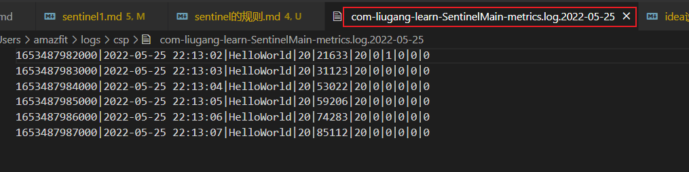
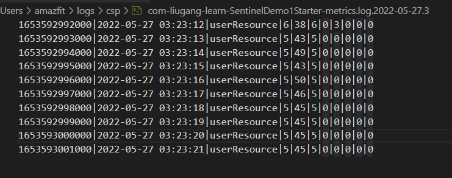
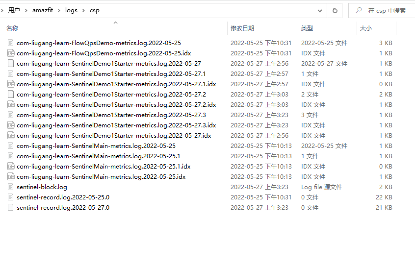
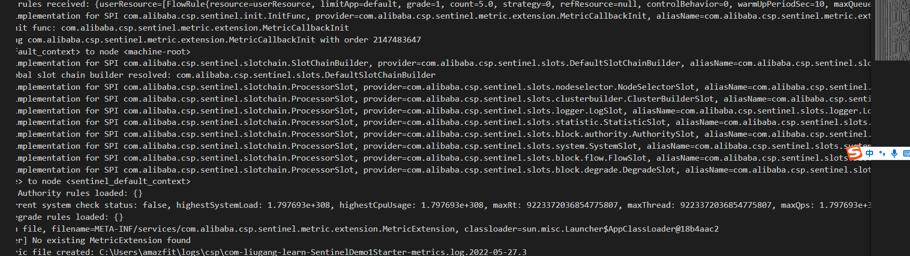

springboot项目启动之后，会在userhome目录，C:\Users\amazfit\logs\csp\

metrics.log 记录每秒的统计信息

|参数|含义|
|-|-|
|timestamp|时间戳|
|datetime|时间|
|resource|访问的资源|
|p|通过的请求数|
|block|被阻止的请求|
|s|成功执行完成的请求数|
|e|用户自定义的异常|
|rt|平均响应时长，单位为ms|

sentinel-record.log，记录sentinel的重要的行为,写入的规则

具体的实时统计记录xx-metrics.log.${date}的文件中。

