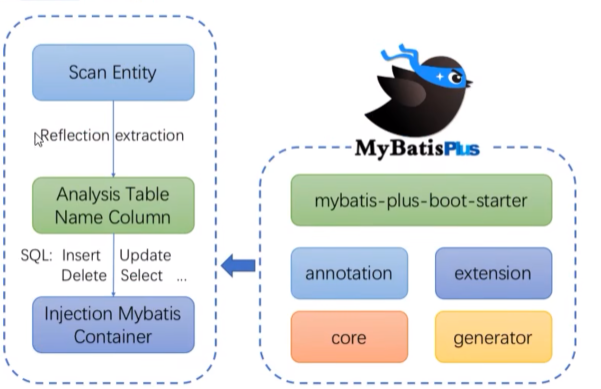

首先扫描实体，通过反射获取到属性。分析操作的表，操作的表的字段。
生成相对应的CURD语句，再注入到Mybatis的container中。

操作的字段，前置条件，由实体类中的属性决定

在mybatis-plus中，默认使用雪花算法创建id。属性使用Long类型

mybatis-plus中，封装IService接口，进一步封装CRUD采用get查询单行，remove删除，list查询集合 page分页 前缀命名方式区分Mapper层

泛型T，为任意实体对象

