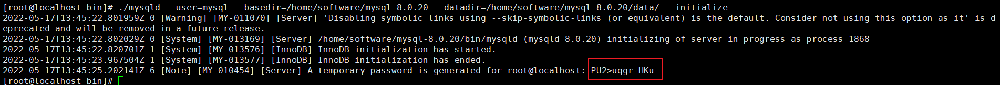
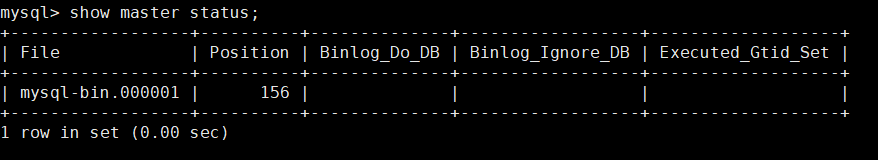
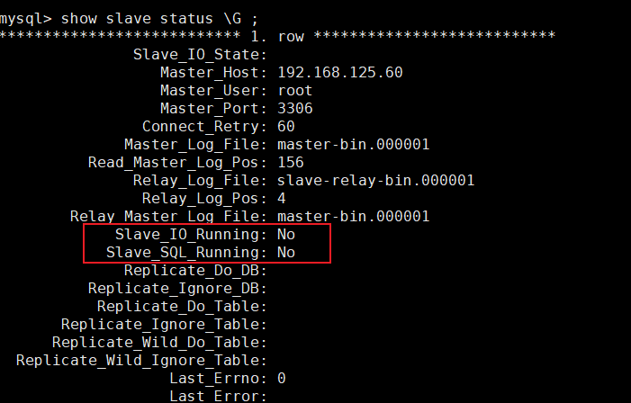
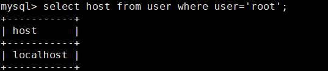

上传gz文件到linux安装的文件夹下/usr/local 
```java
cd /usr/local
```

使用解压命令 tar -zxvf mysql-8.0.20-el7-x86_64.tar.gz 
```java
tar -zxvf mysql-8.0.20-el7-x86_64.tar.gz 
```

解压之后，重命名mysql文件夹 mv mysql-8.0.20-el7-x86_64/ mysql-8.0.20
```java
rm mysql-8.0.20-el7-x86_64.tar.gz
mv mysql-8.0.20-el7-x86_64/ mysql-8.0
```  

创建用户组 groupadd mysql  

创建用户 useradd -g mysql mysql 
```java
groupadd mysql
useradd -g mysql mysql
``` 

授权用户
```java
chown -R mysql.mysql /home/software/mysql-8.0
```

./mysqld --user=mysql --basedir=/usr/local/mysql-8.0 --datadir=/usr/local/mysql-8.0/data/ --initialize

  

?Fxgf4p>gU)
Qd?dg*XGo6re

编辑my.cnf文件
vi /etc/my.cnf  

basedir=/usr/local/mysql-8.0/
datadir=/usr/local/mysql-8.0/data/
socket=/tmp/mysql.sock
character-set-server=UTF8MB4

log-error=/var/log/mariadb/mariadb.log
pid-file=/var/run/mariadb/mariadb.pid

在mysql文件夹下操作
cp -a ./support-files/mysql.server /etc/init.d/mysql

授权添加服务

chmod +x /etc/init.d/mysql
chkconfig --add mysql

/var/run/mariadb/mariadb.pid


ALTER USER 'root'@'localhost' IDENTIFIED BY '123456';
flush privileges;

集群cluster

主节点
server-id=60
#start-binlog
log_bin=master-bin
log_bin-index=master-bin.index

从节点
server-id =61
#start relay-log
relay-log-index=slave-relay-bin.index
relay-log=slave-relay-bin
#打开从服务器的二进制日志
log-bin=mysql-bin
#使得更新的数据写进二进制日志中
log-slave-updates=1


```java
show master status;
```


登录从服务设置
```java
CHANGE MASTER TO MASTER_HOST='192.168.125.60', MASTER_PORT=3306, MASTER_USER='root', MASTER_PASSWORD='password', MASTER_LOG_FILE='master-bin.000001', MASTER_LOG_POS=156 ,GET_MASTER_PUBLIC_KEY=1;
```

记录到的文件，记录到文件的位置
```java
show slave status \G;
```
  

Slave_IO_Running: No
Slave_SQL_Running: No

解决方案：
stop slave;
#跳过错误，继续同步
set global SQL_SLAVE_SKIP_COUNTER=1;
start slave;
应该是远程不能登录root导致
```java
select host from user where user='root';
update user set host = '%' where user ='root';
flush privileges;
```



查看端口号
show global variables like 'port';

报错原因：
error connecting to master 'root@192.168.125.60:3306' - retry-time: 60 retries: 8 message: Host '192.168.125.61' is not allowed to connect to this MySQL server


下载telnet
```java
yum -y install telnet-server.x86_64
 
yum -y install telnet.x86_64
 
yum -y install xinetd.x86_64
```


以5个文件轮训的方式，去记录，

总结：
mysql的账号密码：root password
mysql用户 密码 1q2w3e4r
service mysql start