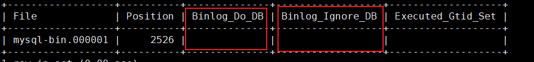

#### 1、Mysql主从架构理解与实战
#### 2、Mysql半同步复制机制详解
#### 3、Mysql集群的高可用架构方案详解
#### 4、分布分表与读写分离详解  


1、60作为mysql主节点，61作为从节点。  

mysql主从集群，
  
可以实现读写分离

主库往从库同步：有延迟，非常小，可以忽略不计  。

可以配合同步一部分库。

加到主库配置文件
```java
#需要同步的二进制数据库名 
binlog-do-db=masterdemo
#不备份的数据库 
binlog-ignore-db=information_schema 
binlog-ignore-db=performation_schema 
binlog-ignore-db=sys
```
改了之后需要重启
service mysql restart


在阿里巴巴公布的开发手册中，建议MySQL单表记录如果达到500W这个级别，
或者单表容量达到2GB，一般就建议进行分库分表。而考虑到分库分表需要对数据
进行再平衡，所以如果要使用分库分表，就要在系统设计之初就详细考虑好分库分
表的方案，这里要分两种情况。