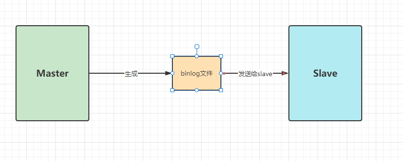
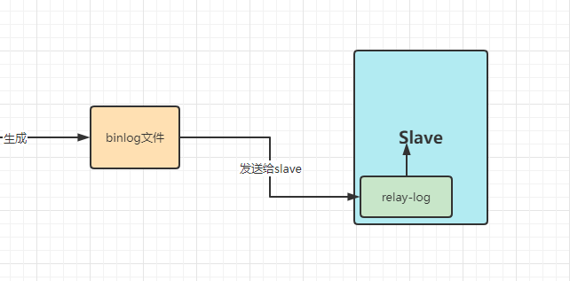

1、配置主节点的mysql配置文件：/etc/my.cnf 这一步需要对master进行配置，主要是需要打开binlog日志，以及指定serverId。我们打开MySQL主服务的My.cnf文件。



my.cnf配置添加
```java
# 服务节点的唯一标识。需要给集群中的每个服务分配一个单独的ID。
server-id:47
# 打开Binlog日志记录，并指定文件名
log_bin:master-bin
# Binlog日志文件
log_bin-index:master-bin.index
```

重启mysql服务 service mysqld restart

然后，我们需要给root用户分配一个replication slave的权限。

```java
#登录主数据库 
mysql -u root -p 
GRANT REPLICATION SLAVE ON *.* TO 'root'@'%'; 
flush privileges; 
#查看主节点同步状态： show master status;
```

slave会通过记录读取的position位置，去从master发过来的binlog文件进行读取起始位置。


配置slave从服务
```java
# 服务节点的唯一标识。需要给集群中的每个服务分配一个单独的ID。
server-id:48
# 打开Mysql中继日志
relay-log:slave-relay-bin 
relay-log-index:slave-relay-bin.index
# 打开从服务二进制日志，bin-log日志
log-bin=mysql-bin
```

启动mysqls的服务，并设置他的主节点同步状态
```java
#登录从服务 
mysql -u root -p; 
#设置同步主节点： 
CHANGE MASTER TO MASTER_HOST='192.168.232.128', MASTER_PORT=3306, 
MASTER_USER='root', 
MASTER_PASSWORD='root', 
MASTER_LOG_FILE='master-bin.000004', 
MASTER_LOG_POS=156 
GET_MASTER_PUBLIC_KEY=1; 
#开启slave 
start slave; 
#查看主从同步状态 
show slave status; 
或者用 show slave status \G; 这样查看比较简洁
```

然后看Slave_IO_Running和Slave_YES_Running是不是都是YES