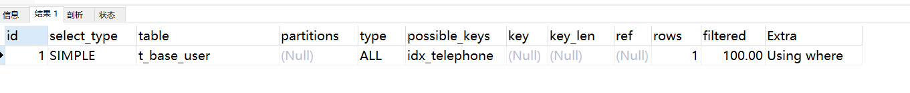
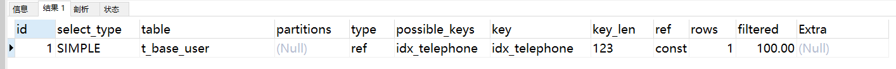

```sql
create table t_base_user(   
oid bigint(20) not null primary key auto_increment,  
name varchar(30) null comment "name",  
email varchar(30) null comment "email",  
age int null comment "age",  
telephone varchar(30) null comment "telephone",  
status tinyint(4) null comment "0 无效 1 有效",  
created_at datetime null default now() comment "创建时间",  
updated_at datetime null default now() comment "修改时间"  )

添加索引

alter table t_base_user add index idx_email(email);
alter table t_base_user add index idx_name(name);
alter table t_base_user add index idx_telephone(telephone);

新增记录

INSERT INTO `andyqian`.`t_base_user` (`name`, `email`, `age`, `telephone`, `status`, `created_at`, `updated_at`) 
VALUES ('111111', 'andytohome@gmail.com', '111', '12345678901', '1', now(),now());
```

#### 试验

##### 隐式转换不走索引，和不转走索引

```sql
explain select * from t_base_user where telephone=12345678901;
```

发现执行计划，显示的是全表扫描，没有在telephone索引树上面去查询。



##### 说明

当操作符与不同类型的操作数一起使用时，会发生类型转换以使操作数兼容。则会发生转换隐式.使用索引去搜索会失效。

```sql
explain select * from t_base_user where telephone='12345678901';
```




```dotnetcli
#显示所有字段
show full columns from t_base_user;
```