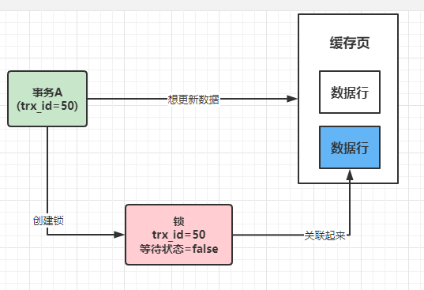
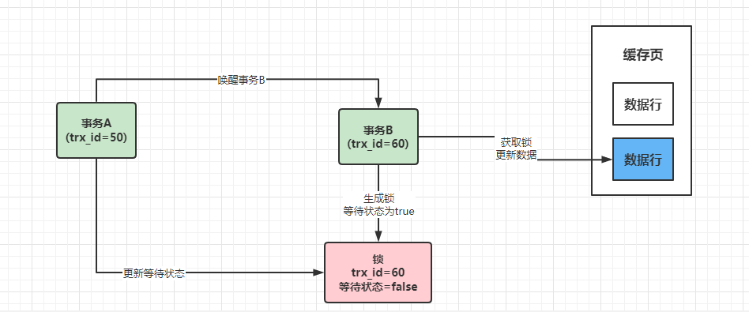

脏写是绝对不允许的，靠锁机制，让多个事务更新一行数据的时候串行化，避免同时更新一行数据。  

事务A去更新的时候，会创建一个锁，包含自己的trx_id和等待状态，把锁跟这行数据关联在一起。  

  

这个锁跟java里边的是一个概念。  

现在，有另外一个事务B过来了，事务B也想更新这行数据，就会检查一下，有没有被加锁  

事务B也会生成一个锁数据结构。进行排队等待。

事务A更新完之后，释放锁，对事务B进行一个唤醒，事务B就获取到锁了。

这种跟sync和reentranlock没啥区别。  
都是独占锁，（insert、delete、update）都是独占锁