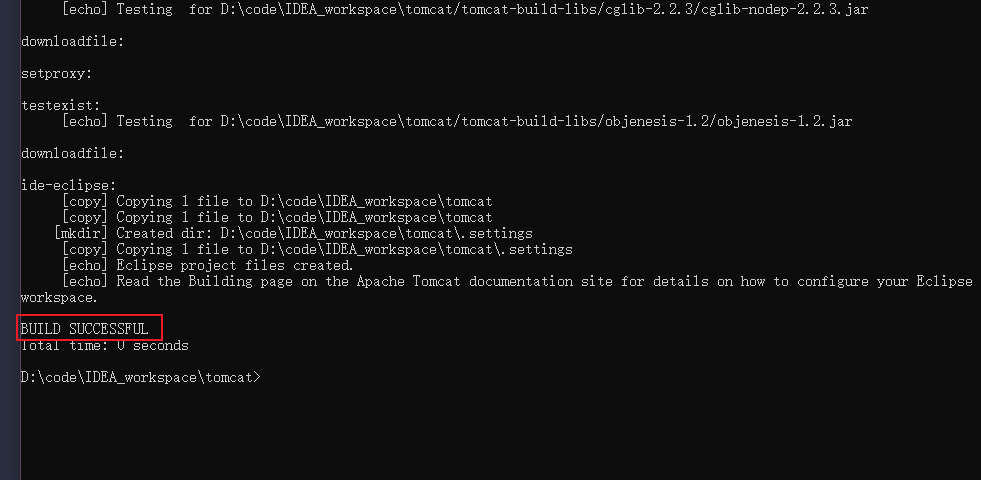
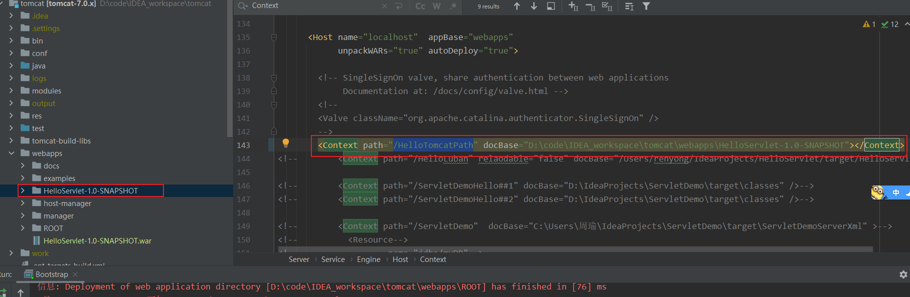
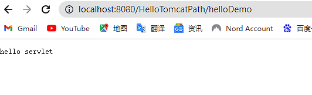
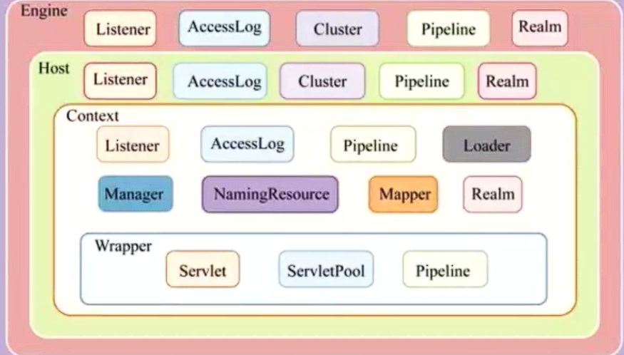
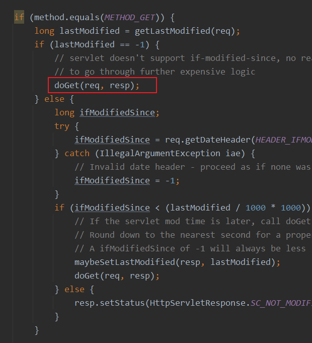
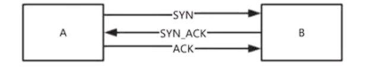
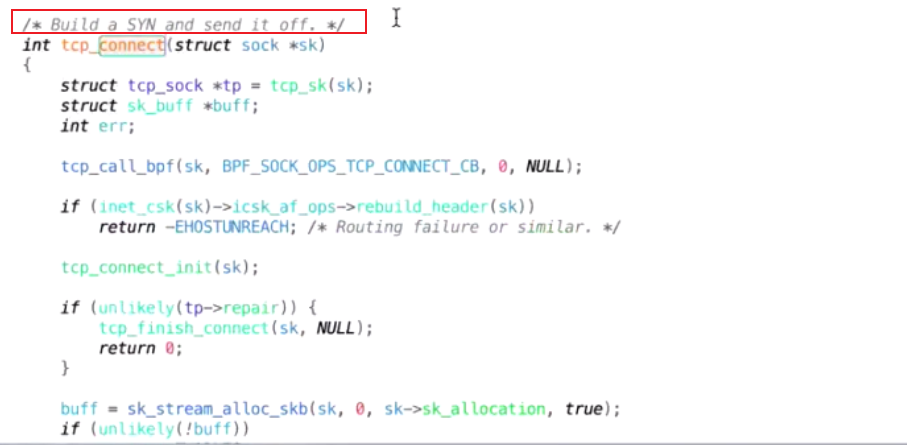
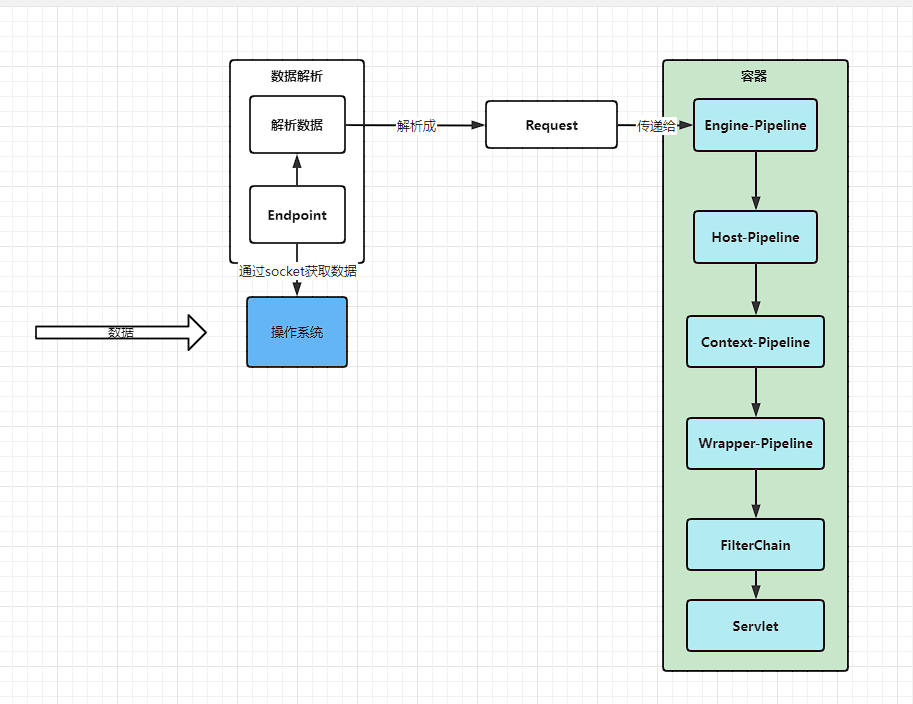

#### Tomcat整体架构和处理请求流程解析
#### Tomcat中关于长连接的底层原理与源码实现
#### Tomcat中自定义类加载器的使用与源码实现(双亲委派)
#### Tomcat请求处理详解
#### Tomcat启动流程
#### Tomcat中Session功能的实现
#### Tomcat中JSP功能的实现

在tomcat的源码中，切到7.0.x-vip的分支，在cmd中
输入命令，ant ide-eclipse

就是下载tomcat-build-libs里面的jar包

然后再用idea，导入的办法，用eclipse的方式导入

----------------------------开始，**tomcat是一个servlet容器**

一个应用用tomcat部署有哪几种方式？
1、可以直接使用war包
2、可以使用编译后的文件夹，直接挪到webapps

server.xml的的配置
host标签，name属性，可以设置多个不同的域名做虚拟主机。用ip默认走localhost

tomcat访问启动之后，访问http://localhost:8080/HelloServlet-1.0-SNAPSHOT/helloDemo

某某war包和某某jar包其实里面的东西是一样的。
为什么用war包，而不是jar包呢
Tomcat源码里面是写死的。
在HostConfig里面，deployApps，写死的，对.war包结尾，去进行部署

另外一种部署方式，在server.xml里面，在Host标签里面，Context标签定义一个应用。

Pipeline 管道 value 阀门

Engine 管理Host=》List<Host>
    List(Host)
    Pipeline

Host标签表示，虚拟的主机。可以定义多个Host，name不同。
    List(Context)
    Pipeline

Context在源码里面是一个接口，对应的就是一个容器。
    List(Wrapper) servlets
    Pipeline values....调用servlet实例，不是传真正的Reqeust，而是RequestFacade

如果实现了SingleThreadModel，那么就有一个Servlet对象有多个实例。
Wrapper-------Servlet类
List(Servlet) servlets;
Pipeline

每一个管道，都有一个List的默认的阀门（list(value)）
管道从哪里来？涉及到其他组件

tomcat接受到请求之后，------>封装一个Request，先交给最上层的容器Engine，经过你管道里面所有的阀门，定义的是什么，就处理什么。

Request，RequestFacade，源码

web工程的Filter使用，过滤器过程的使用，当我在执行servlet的doGet方法之前，

ApplicationFilterChain，有点像责任链模式。

看源码发现，是调用service方法，不是调用doGet方法
HttpServlet里面的service方法。

Tomcat:8080
数据------>Request
操作系统给应用程序的，操作系统又是从别的系统来的。

服务器A--------->服务器B
数据+IP
TCP协议，安全可靠的协议，两台服务器，服务器A发给服务器B，是可靠的，保证数据不丢失。
TCP，传输数据的协议，运行在操作系统上的应用程序生成数据，再去掉操作系统的接口去传输出去。
建立TCP协议，需要进行三次握手
Http协议，
两个协议，肯定是需要别人去实现的。

TCP是由谁在实现的，操作系统来实现的，mac，windows，linux
linux的tcp源码tcp_output.c
1、应用程序生成数据 
2、操作系统建立TCP连接 -------Java------TCP

    java程序怎么调用操作系统的TCP连接方法，操作系统不让调TCP连接方法
    socket，linux里面就有socket.c文件。提供给上层的应用程序来用

httpclient，tomcat底层都是socket
创建socket，底层就是native的socketCreate方法， 然后openjdk里面的代码是
调用操作系统的socket方法。
从socket取数据,tomcat就是把从socket的数据，请解析出来。通常就是http协议。
http就是应用层       

socket--HTTP协议--解析--Request

endpoint先根据io模型拿到数据，再去解析数据

Tomcat取数据，肯定跟IO模型有关
BIO
NIO
APR-----Apache IO工具，跟NIO很像，取数据的方式。                                                                                                                                                                        

    
3发送数据

Tomcat的server.xml里面的Connector标签