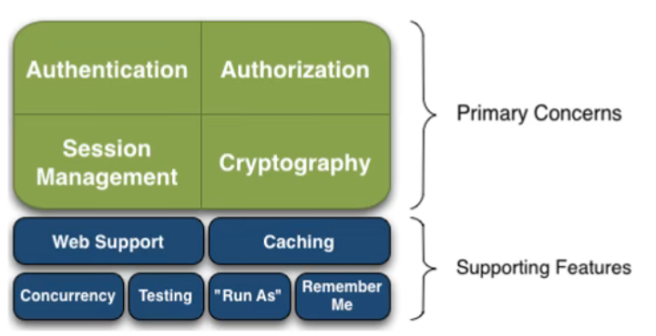

#### shiro是个啥

Apache Shiro™是一个功能强大且易于使用的 Java 安全框架，它执行身份验证、授权、加密和会话管理。借助 Shiro 易于理解的 API，您可以快速轻松地保护任何应用程序——从最小的移动应用程序到最大的 Web 和企业应用程序。



* Authentication:身份校验
* Authorization：身份授权
* Session Management：session管理
* Cryptography：加密

##### 使用shiro
避开不了SecurityManager

##### 配置
在resources下新建shiro.ini文件
```properties
[users]
root = secret, admin
guest = guest, guest
presidentskroob = 12345, president
darkhelmet = ludicrousspeed, darklord, schwartz
lonestarr = vespa, goodguy, schwartz

# -----------------------------------------------------------------------------
# Roles with assigned permissions
# roleName = perm1, perm2, ..., permN
# -----------------------------------------------------------------------------
[roles]
admin = *
schwartz = lightsaber:*
goodguy = winnebago:drive:eagle5
```

users 表示用户 

roles 表示角色

具体简单实操，看https://github.com/cocodx/springboot-shiro.git
子项目 shiro-demo1

##### realm
realm就是代表用户数据的来源，前面是通过shiro.ini来获取。实际工作中肯定是从数据库中拿用户数据。

shiro中是有提供抽象类，我们只需要去extends就行了

