value数据结构

#### String 单值缓存
String应用场景
```java
SET key value
GET key
```

**对象缓存** 

SET user:1 vlaue(json格式)】  
mset user:1:name zhuge user:1:balance 1888  
mget user:1:name user:1:balance

**分布式锁**
setnx product:10001 true
设置成功返回1，设置失败返回0

DEL product:10001 //执行完业务释放锁

set product:10001 true ex 10 nx //防止程序意外终止导致死锁  
ttl product:10001  //查看key的过期时间

**计数器**
incr article:readcount:{文章id}  
get article:readcount:{文章id}  

web集群session共享
spring session + redis实现session共享

分布式系统全局序列号
incrby orderId 1000  //redis批量生成序列号，每次取1000，再去交互
小问题：1，第一台机器拿到500就挂了呢，小问题。如果不连续就不适合。（123456789）

**Hash常用操作**
对象缓存
hmset user {userId}:name zhuge {userId}:balance 1888
hmset user 1:name zhuge 1:balance 1888
hmget user 1:name 1:balance
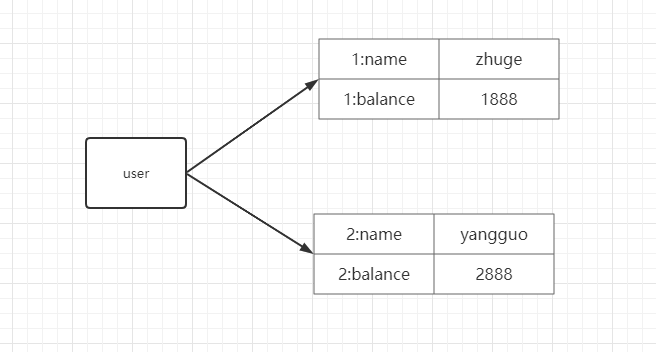

bigkey操作，分段存储。
就是user太大了，取出来耗时

**电商购物车**
用户id为key
商品id为field
商品数量为value


购物车操作
添加商品 hset cart:1001 10088 1
添加数量 hincrby cart:1001 10088 1
商品总数 hlen cart:1001
删除商品 hdel cart:1001 10088
获取购物车所有商品 hgetall cart:1001

使用hash优点：
1. 同类数据归类整合存储，方便数据管理
1. 相比string操作消耗内存与cpu更小
1. 相比string存储更节省空间

缺点
1. 过期功能不能使用在field上，只能用在key上
1. redis集群架构下不适合大规模使用（某个节点存放过多，数量全打到某一个节点了。分配不均）优化，key均匀分配到每个节点。

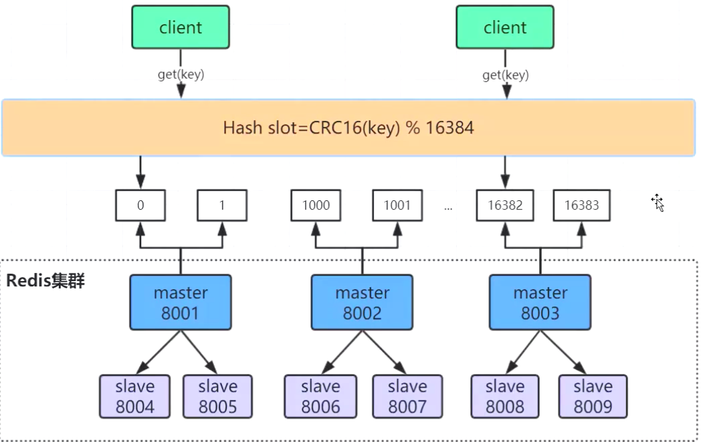

LPUSH key value[value......] //将一个或多个值value，插入到key列表的表头（最左边）
RPUSH key value[value......] //将一个或多个值value，插入到key列表的表尾（最右边）
LPOP key  //移除并返回Key列表的头元素
RPOP key  //移除并返回Key列表的尾元素
LRANGE key start stop   //返回列表key中指定区间内的元素，区间以偏移量start和stop指定
BLPOP key [key ...] timeout   //从key列表表头弹出一个元素，若列表中没有元素，阻塞等待timeout秒，如果timeout=0，一直阻塞等待
BRPOP key [key ...] timeout   //从key列表表尾弹出一个元素，若列表中没有元素，阻塞等待timeout秒，如果timeout=0，一直阻塞等待
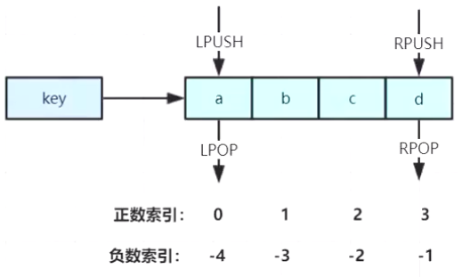

* 常用数据结构
Stack（栈）=LPUSH+LPOP = FILO
Queue（队列）=LPUSH+RPOP = FIFO
Blocking MQ（阻塞队列）= LPUSH+BRPOP
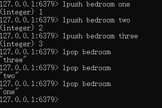
three,最后放的，但是最先拿。 分布式环境，就不能用jdk提供的了。
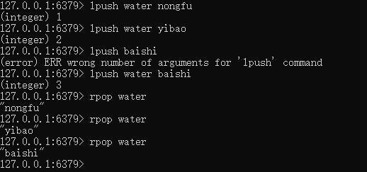

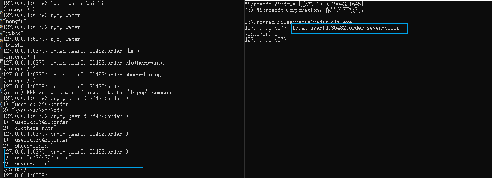
执行一下，消费一下，执行一下，消费一下。timeout为0，阻塞

List应用场景
* **微博消息和微信公众号消息**

关注了MacTalk 备胎说车等大V
1）MacTalk发微博，消息ID为10018
LPUSH msg:{诸葛老师-ID} 10018
2）备胎说车发微博，消息ID为10086
LPUSH msg:{诸葛老师-ID} 10086
3）查看最新微博消息
LRANGE msg:{诸葛老师-ID} 0 4
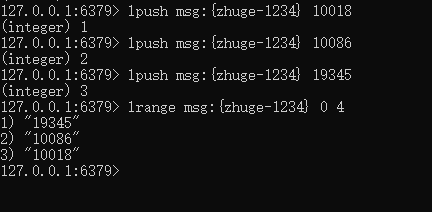
这样最新的消息就在最上面，万一用户量特别大，MacTalk粉丝特别多，往几百万个粉丝的列表里发消息。一两千个还是可以的。可以分批发，首先给在线用户发，后面其他用户慢慢在后台发。
新浪微博的技术方案。pull方式，大V放队列放，其他用户往队列里面拿，发布订阅模式。缺点，如果订阅了很多大V，那就上线了，还是去别人大V的队列里面都拉一下到本地，再去进行排序。

Set结构
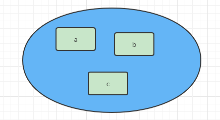
[大key是value很大，不是key大]
sadd key member [member ...] //往集合key中存入元素，元素存在则忽略，若不存在就新建
srem key member [member ...] //从集合key中删除元素
smembers key   //获取集合key中所有的元素
scard key      //获取集合key的元素个数
sismember key member   //判断member元素是否存在于集合key中
srandmember key count  //从集合key中选出count个元素，元素不从key中删除
spop key count         //从集合key中选出count个元素，元素从key中删除

* 微信抽奖小程序

1)点击参与抽奖加入集合
sadd key {userId}
2)查看参与抽奖用户
smembers key
3)抽取count名中奖者
srandmember key [count] /spop key [count]  

                              
* 微信微博点赞，收藏，标签 (微博是用的) 
1）点赞
sadd like:{消息id} {用户id}
2）取消点赞
srem like:{消息id} {用户id}
3）检查用户是否点过赞
sismember like:{消息id} {用户id}
4）获取点赞的用户列表
smembers like:{消息id}
5）获取点赞用户数
scard like:{消息id}

早些年微博会挂，大V发条消息，微博就很容易挂。redis用的存储几百T。

* 集合操作
set的交集 **（相交）** 和并集 **（合并）** 和差集 （用第一个集和减去后面集和的并集）只看第一个集和的还剩什么。
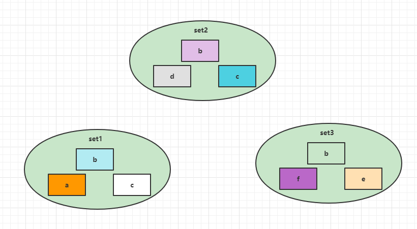
sinter set1 set2 set3 -> {b}
sunion set1 set2 set3 -> {abcdef}
sdiff set1 set2 set3 -> {a}
sdiff的过程：set1现在有（a，b，c），第二三个并集为（b,c,d,e,f）
set1 {a,b,c} 减去 {b,c,d,e,f} = bc都有去掉。只剩一个a。

集合操作实现微博微信 **关注模型**
1）诸葛老师关注的人：
zhugeSet -> {guojia,xushu}
2) 杨过老师关注的人：
yanguoSet -> {zhuge,baiqi,guojia,xushu}
3) 郭嘉老师关注的人：
guojiaSet -> {zhuge,yangguo,baiqi,xushu,xunyu}
4) 我和杨过老师公共关注：
sinter zhugeSet yangguoSet --> {guojia,xushu}
5）我关注的人也关注过他（杨过老师）：
我关注的人，岳云鹏，黄渤。在不在孙红雷的关注列表里面。
sismember guojiaSet yangguo
sismember xushuSet yangguo
6） 我可能认识的人：
sdiff yangguoSet zhugeSet -> (zhuge,baiqi)

**集和操作实现电商商品筛选！！！** **作业**
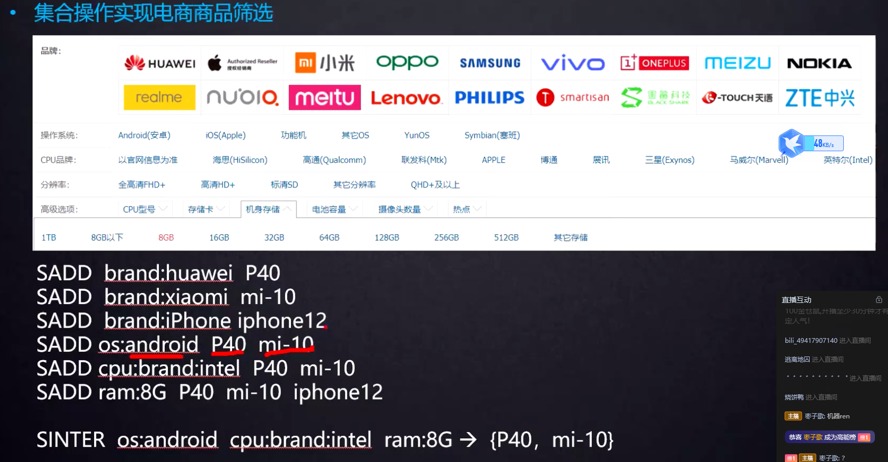

Zset 有序集和(跳跃表)
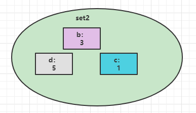
zadd key score member [[score member]]... //往有序集合key中加入带分值元素
zrem key member [member...] //往有序集合key中删除元素 
zscore key member  //返回有序集合key中元素member的分值
zincrby key increment member //为有序集合key中元素member的分值加上increment
zcard key //返回有序集合key中元素个数
zrange key start stop [withscores] //正序获取有序集合key从start下标到stop下标的元素
zrevrange key start stop [withscores]  //倒序获取有序集合key从start下标到stop下标的元素 **（从大到小是倒序，从小到大是正序）**

Zset集合操作
zunionstore destkey numkeys key [key ...] //并集计算
zinterstore destkey numkeys key [key ...] //交集计算

*Zset 集合操作实现排行榜

1)点击新闻
zincrby hostNews:20220503 1 帕梅拉 录播
2)展示当时排行前十
zrevrange hostNews:20220503 0 9 withscores
3)七日搜索榜单计算
zunionstore hostNews:20220503-hostNews:20220510 7
hostNews:20220503 hostNews:20220504 hostNews:20220505 hostNews:20220506...
4)展示七日排行前十
zrevrange hostNews:20220503-hostNews:20220510 0 9 withscores

<a href="https://redis.io/commands">命令地址</a>或者使用help @sorted_set


**Redis真的是单线程的吗？**
严格意义上来说，不是单线程。
Redis的单线程主要是指Redis的网络IO和键值对读写是由一个线程来完成的，这是Redis对外提供兼职存储服务的主要流程。
但是Redis的其他功能，比如持久化、异步删除、集群数据同步等，其实是由额外的线程执行的。

redis压测命令 src/redis-benchmark get
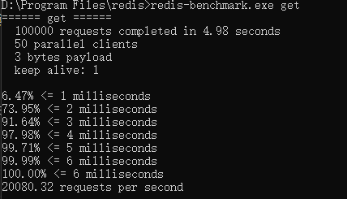

Redis单线程为什么还能这么快？
因为它所有的数据都在内存中，所有的运算都是内存级别的运算，而且单线程避免了多线程的切换性能损耗问题。要小心使用Redis指令，对于那些耗时的指令（比如keys），一定要谨慎使用，一不小心就导致Redis卡顿。

Redis单线程如何处理那么多得并发客户端连接？
Redis的IO多路复用:redis利用epoll来实现IO多路复用，将连接信息和事件当道队列中，依次放到文件事件分排器，事件分排器将事件分发给事件处理器。
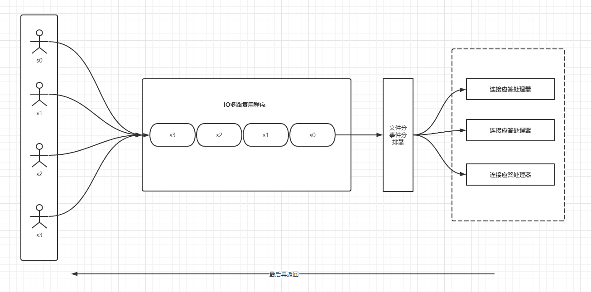
让IO等待过程中，做其他事情。NIO非阻塞

查看redis支持的最大连接数，在redis.conf文件中可修改， # maxClients 10000
config get maxclients
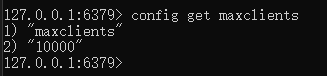

keys:全量遍历键，用来列出所有满足特定正则字符串规则的key，当redis数据量较大时，性能较差，避免使用

scan：渐进式遍历键
