1，RDB、AOF混合持久化详解
2，并行持久化之写时复制机制
3，Redis主从架构详解
4，Redis管道及lua脚本详解
5，Redis哨兵高可用架构详解

大公司重度依赖redis。
RDB快照（snapshot）
在默认情况下，Redis将内存数据库快照保存在名字为dump.rdb的**二进制文件**中。
你可以对Redis进行设置，让它在N秒内数据集至少有M个改动，这一条件被满足时，自动保存一次数据集。
比如说，以下设置会让Redis在满足“60”秒内至少有1000个键被改动，这一条件时，自动保存一次数据集。
```java
# save 60 1000 //关闭rdb只需要将所有的save保存策略注释掉即可
```

还可以手动执行命令生成RDB快照，进行redis客户端执行命令save或bgsave可以生成dump.rdb文件，每次命令执行都会将所有redis内存快照到一个新的rdb文件里，并覆盖原有的rdb快照文件。
save命令会阻塞redis的写命令的。

bgsave命令也会生成
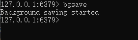

bgsave的写时复制（cow）机制。
Redis借助操作系统提供的写时复制技术（copy on write），在生成快照的同时，依然可以正常处理写命令。简单来说，bgsave子进程由主线程fork生成的，可以共享主线程的所有内存数据。bgsave子进程运行后，开始读取主线程的内存数据，并把它们写入RDB文件。此时，如果主线程对这些数据也都是读操作，那么主线程和bgsave子进程相互不影响。但是，如果主线程要修改一块数据，那么，这块数据就会被复制一份，生成该数据的副本。然后，bgsave子进程会把这个副本数据写入RDB文件，而这个过程中，主线程仍然可以直接修改原来的数据。
大白话：在保存写副本的过程中，再有写命令过来，也会同步到子进程去写到那个副本里，这里，两边都修改。

rdb的问题：一次rdb，内存几个G都要持久化。很多条命令执行之后，才去执行rdb持久化。那么如果这时候执行了60秒内，执行了999条改动，还差一条改动就可以save了。但是redis挂掉了，那么就丢失999条了。丢数据。

save和bgsave对比
|**命令**|**save**|**bgsave**|
|-|-|-|
|IO类型|同步|异步|
|是否阻塞redis其他命令|是|否（在生成子进程执行调用fork函数时会有短暂阻塞）|
|复杂度|O(n)|O(n)|
|优点|不会消耗额外内存|不阻塞客户端命令|
|缺点|阻塞客户端命令|需要fork子进程，消耗内存|
**配置自动生成rdb文件后台使用的是bgsave方式**

AOF（append-only-file）
快照功能并不是非常耐久（durable）：如果Redis因为某些原因而造成故障停机，那么服务器将丢失最近写入、且仍未保存到快照中的那些数据。从1.1版本开始，redis增加了一种完全耐久的持久化方式，将修改的每一条指令记录进文件appendonly.aof中（先写入os cache，每隔一段时间fsync到磁盘）
你可以通过修改配置文件来打开AOF功能：
```java
appendonly yes
```
从现在开始，每当Redis执行一个改变数据集的命令时，比如SET，这个命令就会被追加到AOF文件的末尾。这样的话，当Redis重新启动时，程序就可以通过执行AOF文件中的命令来达到重建数据库集的目的。
你可以配置Redis多久才将数据fsync到磁盘一次。
有三个选项：
```java
appendfsync always:每次有新命令追加到AOF文件时就执行一次fsync，非常慢，也非常安全。
appendfsync everysec:每次fsync一次，足够快，并且在故障时只丢失1秒钟的数据。
appendfsync no:从不fsync，将数据交给操作系统来处理。更快，也更不安全的选择。
```
推荐（并且也是默认）的措施为每秒fsync一次，这种fsync策略可以兼顾速度和安全性。

appendonly.aof文件截图如下：


AOF**重写**
AOF文件里可能有太多没用指令，所以AOF定期根据内存的最新数据生成aof文件
aof文件恢复
```java
redis-check-aof.exe --fix appendonly.aof
```
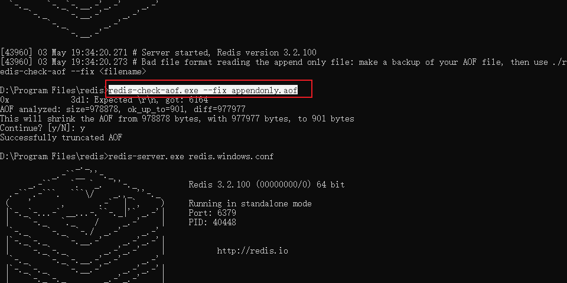
例如,执行6次累加操作
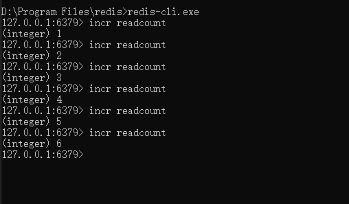
重写后AOF文件里会有变化，会把这重复的命令变成一个set value操作


如果超过64m，重写去掉垃圾命令
```java
auto-aof-rewrite-percentage 100  //aof文件自上一次重写后文件大小增长了100%,则再次触发重写
auto-aof-rewrite-min-size 64mb   // aof文件至少要达到64M才会自动重写，文件太小恢复速度本来就很快，重写的意义不大
```
当然AOF还可以手动重写，进入redis客户端执行命令bgrewriteaof重写AOF
注意，AOF重写和redis会fork一个子进程去做（与bgsave命令类似），不会对redis正常命令处理有太多影响。基于内存数据，拿命令写进aof文件。
RDB和AOF，怎么选择。
|命令|RDB|AOF|
|-|-|-|
|启动优先级|低|高|
|体积|小|大|
|恢复速度|快|慢|
|数据安全性|容易丢数据|根据策略决定|
生产环境可以都启动，redis启动时如果，有rdb，又有aof文件，则优先选择aof文件恢复数据，因为aof一般来说数据更全一点。

**Redis4.0 混合持久化**
重启Redis时，我们很少使用RDB来恢复内存状态，因为会丢失大量数据，我们通常使用AOF日志重放，但是重放AOF日志性能相对RDB来说要慢很多，这样redis实例很大的情况下，启动需要花费很长的事件。Redis4.0为了解决这个问题，带来了一个新的持久化选项--混合持久化。
```java
aof-use-rdb-preamble yes(必须先开启aof)
```
如果开启了混合持久化，AOF在重写时，不再是单纯将内存

AOF重写时候（bgrewriteaof），就不是aof的命令形式，而是类似于rdb这种二进制格式追加到aof文件里面。再正常写入的时候，又是以命令追加到文件里面。等重写完新的AOF文件才会进行改名，覆盖原有的aof文件，完成新旧两个AOF文件的替换。
于是redis重启的时候，会先加载rdb文件，再去用命令
使用混合持久化，就可以把rdb关掉，把conf文件的save给注释掉。
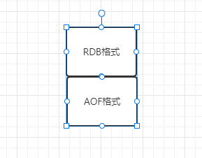

Redis数据备份策略：
1，写crontab定时调度脚本，每小时都copy一份rdb或aof的备份到一个目录中去，仅仅保留过去最近48小时的备份
2，每天都保留一份当日的数据备份到一个目录中去，可以保留最近一个月的备份
3，每次copy备份的时候，都把太旧的备份给删了
4，每天晚上将当前机器的备份复制到一份到其他机器上，以防机器损坏。
发现redis在被kill掉的时候，会出发生成append-only.aof文件，还有dump.rdb文件。

#### Redis主从架构
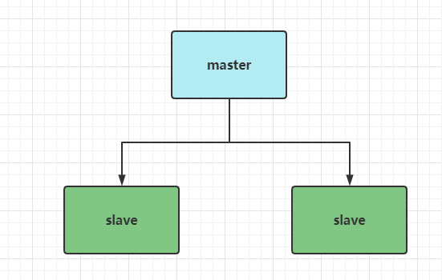
```java
replicaof 192.168.0.60 6379
replica-read-only yes  //只读
```
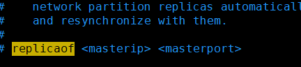
从节点，是只读的，不然多台节点写命令，数据搞乱了。

在redis.conf配置里面有bind，这个是表示，允许什么id能够访问这台redis。
127.0.0.1 表示只有本机才能访问redis，所以要绑定实际IP地址

如果你为master配置一个slave，不管这个slave是否第一次连接上master，它都会用**psync**命令
给master请求复制数据。
master收到psync命令之后，会在后台进行数据持久化通过bgsave生成最新的rdb快照文件，持久化期间，master会继续接收客户端的请求，它会把这些可能修改数据集的请求缓存在内存中。当持久化进行完毕以后，master会把这份rdb文件数据集发送给slave，slave会把接收到的数据进行持久化生成rdb，然后再加载到内存中。然后master再将之前缓存在内存中的命令再发送给slave。
当master与slave之间的连接，由于某些原因而断开时，slave能够自动重连master，如果master收到了多个slave并发连接请求，它只会进行一次持久化，而不是一个连接一次，然后再把这一份持久化的数据发送给多个并发连接的slave。

主从复制流程图
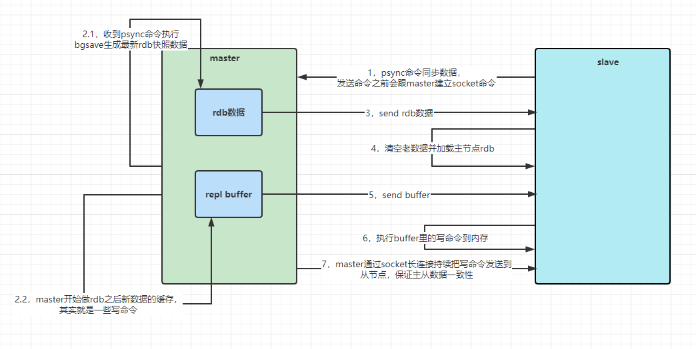
这个跟开不开启rdb策略没关系。

redis.conf配置缓冲区
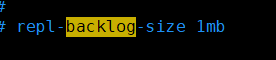
repl backlog buffer 是先进先出 

断点续传
**数据部分复制**
当master和slave断开重连后，一般都会对整份数据进行复制。但从redis2.8开始，redis改用可以支持部分数据复制的命令psync去master同步数据，slave与master能够在网络连接断开重连后只进行部分数据复制。（断点续传）
master会在其内存中创建一个复制数据用的缓存队列，缓存最近一段时间内的数据，master和它所有的slave都维护了复制的数据下标offset和master的进程id，因此，当网络连接断开后，slave会请求master继续进行未完成的复制，从所记录的数据下标开始。如果master的进程id变化了，或者从节点数据下标offset太旧，已经不在master的缓存队列里了，那么将会进行一次全量数据的复制。
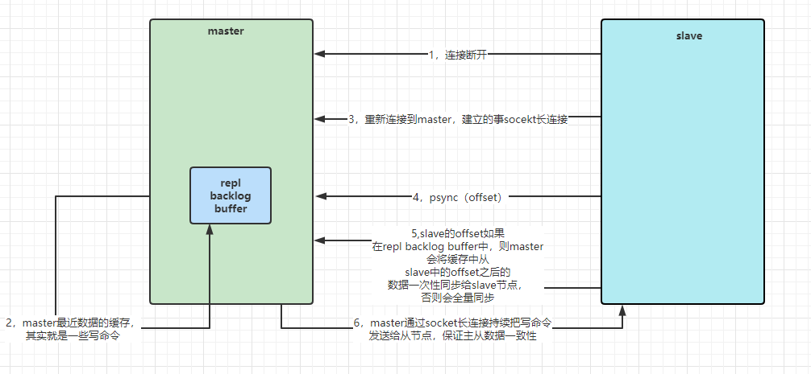


主从复制的优化。（主从复制风暴）
如果说有大量的redis的从节点，跟主节点复制，那么可以让从节点与从节点复制。
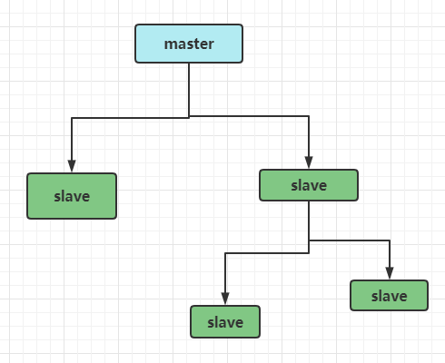

使用jedis连接redis的代码。
//TODO 待会上传到github
代码地址：<a href=""></a>

读写分离，要写个插件。通过插件实现，发现是写命令，发到主节点，发现是读命令，发到读节点

管道操作（一次性发到redis里面去执行）
4,5条命令要4,5网络开销，管道只需要一次
管道（Pipeline）
客户端可以一次发送多条命令而不用等待服务器的响应，等所有命令都发送完后，再一次性读取服务的响应，这样可以极大的降低多条命令执行的网络传输开销，管道执行多条命令的网络开销，实际上就一次命令的网络开销。需要注意的是用pipeline方式打包命令发送，redis必须在**处理完所有命令前先缓存起所有命令的处理结果。**打包的命令越多，缓存消耗内存也越多。并不是打包的命令越多越好。
pipeline中发送的每个command都会被server立即执行，如果执行失败，将会在此后的响应中得到信息，也就是说pipeline，不会回滚，没有事务性质。对后面的命令不会有影响，继续执行。

**Redis lua脚本**
在2.6开始，允许开发者使用Lua语言写脚本到redis中执行。使用脚本的好处：
1. 减少网络开销：本来5次网络请求的操作，可以使用一个请求完成。减少了网络往返时间延迟，跟管道类似。
1. 原子操作：Redis将脚本作为一个整体执行，中间不会被其他命令插入。管道不是原子的，不过redis的批量命令mset是原子的。
1. 替换redis的事务功能：redis事务很垃圾，官方推荐。
```java
EVAL script numkeys key [key ...] arg [arg ...]
```
```java
192.168.125.100:6379> eval "return {KEYS[1],KEYS[2],ARGV[1],ARGV[2]}" 2 key1 key2 first second
1) "key1"
2) "key2"
3) "first"
4) "second"

```

注意：不要在Lua脚本中出现死循环和耗时的运算，否则redis会阻塞，将不接受其他的命令，所以使用时主要不能出现死循环、耗时的运算。redis时单线程、单线程执行脚本。管道不会阻塞redis。
在Lua脚本中，使用redis.call()函数执行redis命令

**Redis哨兵机制**
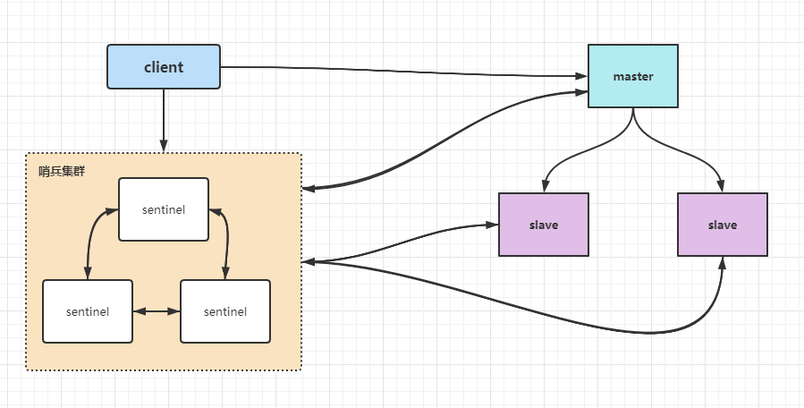
sentinel哨兵是特殊的redis服务，不提供读写服务，主要用来监控redis实例节点。
哨兵架构下client端第一次从哨兵找出redis主节点，后续就直接访问redis的主节点，不会每次都通过sentinel代理访问redis的主节点，当redis的主节点发生变化，哨兵会第一时间感知到，并且将新的redis主节点通知给client端（这里面的redis的client端一般都实现了订阅功能，订阅的sentinel发布的节点变动消息）

sentinel.conf配置文件：
```java
daemonize yes //后台启动
sentinel monitor mymaster 192.168.125.61 6379 2 //配置master的ip和端口，数字2表示有几台sentinel觉得master挂了，重新选举master。
```
在sentinel运行一会之后，就写信息追到sentinel.conf末尾。
```java
sentinel myid 854a016e3bc191cc316bbd75cd7ab22cbe352a88
sentinel config-epoch mymaster 1
sentinel leader-epoch mymaster 0
sentinel current-epoch 1
sentinel known-replica mymaster 192.168.125.100 6379
sentinel known-sentinel mymaster 192.168.125.60 26379 3f38c824c77d788bbb9fcbf0dcdc0f076175d666
sentinel known-replica mymaster 192.168.125.60 6379
sentinel known-sentinel mymaster 192.168.125.61 26379 d3dd29c980aeef0a1ecd34a11e5bdadcecc0e926
```

./redis-sentinel ../conf/sentinel.conf
info 命令打印服务端的信息

启动哨兵的方法，准备3台redis机器，启动3台哨兵
如果哨兵挂了，整个集群瘫痪，访问不了。
使用springboot整合redis。访问redis的sentinel架构。
springboot2.x，使用的连接池是lettcue不是jedis

6379启动之后，启动之后，变成从节点跟主节点同步。
StringRedisTemplate 继承自RedisTemplate，也拥有上面这些操作
StringRedisTemplate 默认采用的是String的序列化策略，保存的key和value都是采用此策略序列化保存的。
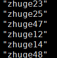
RedisTemplate默认采用的JDK的序列化策略，保存的key和value都是采用此策略序列化保存的。
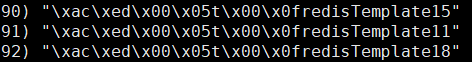