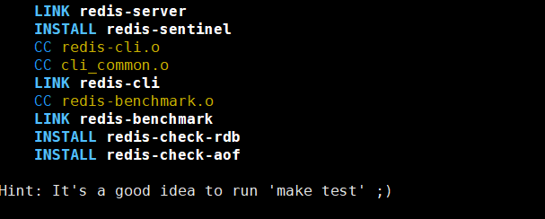
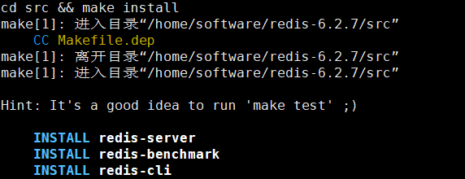

<a href="https://download.redis.io/releases/">下载redis指定版本的地址</a>

在这个地址下载好，上传到linux服务器

安装redis的编译环境，且编译redis
```java
yum install gcc 
```

```java
进行redis的目录，输入make
```

再安装redis
```java
make PREFIX=/home/software/redis_install install
```



再把redis.conf移动到redis_install文件夹下。