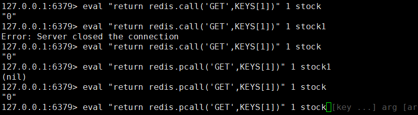
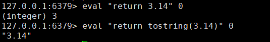

Redis中使用EVAL命令来直接执行指定的Lua脚本。

```java
EVAL luascript numkeys key [key ...] arg [arg ...]
```
* EVAL 命令的关键字。
* luascript Lua 脚本。
* numkeys 指定的Lua脚本需要处理键的数量，其实就是 key数组的长度。
* key 传递给Lua脚本零到多个键，空格隔开，在Lua 脚本中通过 KEYS[INDEX]来获取对应的值，其中1 <= INDEX <= numkeys。
* arg是传递给脚本的零到多个附加参数，空格隔开，在Lua脚本中通过ARGV[INDEX]来获取对应的值，其中1 <= INDEX <= numkeys。



call函数和pcall函数  
call函数会直接返回错误，pcall函数会封装一下，再返回。  
就像java遇到一个异常，前者会直接抛出异常，后者把异常处理为json返回。  

精度丢失


##### 原子执行
ua脚本在Redis中是以原子方式执行的，在Redis服务器执行EVAL命令时，在命令执行完毕并向调用者返回结果之前，只会执行当前命令指定的Lua脚本包含的所有逻辑，其它客户端发送的命令将被阻塞，直到EVAL命令执行完毕为止。因此LUA脚本不宜编写一些过于复杂了逻辑，必须尽量保证Lua脚本的效率，否则会影响其它客户端。

##### 使用lua脚本来弄ex和nx一块。保证原子性
原生命令
```java
set nxpxKey 1 px 100000 NX
```
redis操作lua脚本
```java
eval "eval "if redis.call('setnx',KEYS[1],ARGV[1]) == 1 then redis.call('expire',KEYS[1],ARGV[2]) return 1 else return 0 end" 1 nxpxKey nxpxKey-Value 100000"
```
冒号结尾 1 表示：keys只有一个参数（keys主要是放key的）  
args 主要是放 其他参数的  

2.6.12也是新增了set 
```java
SET key value[EX seconds][PX milliseconds][NX|XX]
```