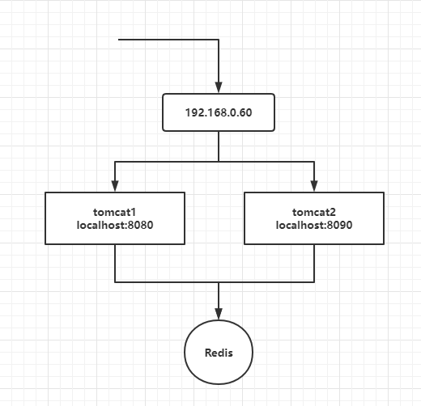
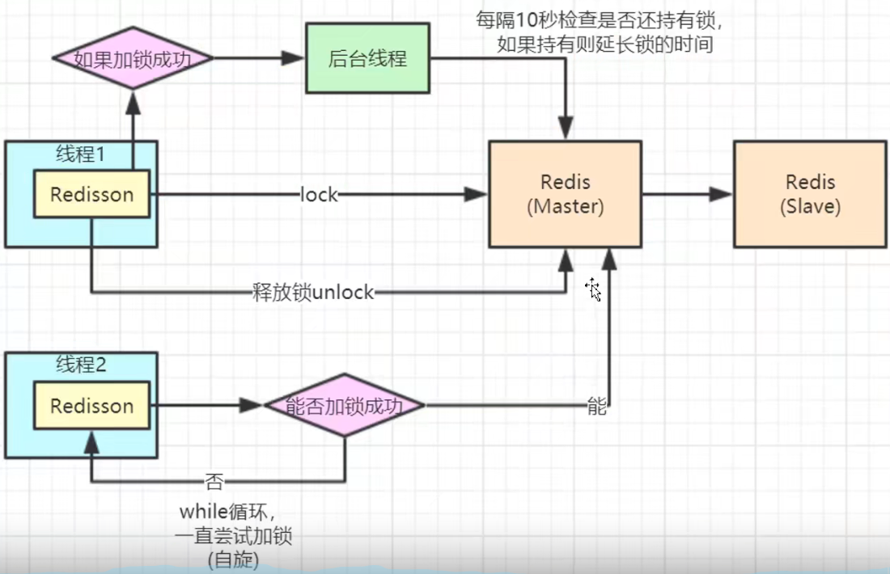

 { width: 200px; }
```java
@RequestMapping("/deduct_stock")
    public String deductStock(){
        synchronized (this){
            int stock = Integer.parseInt(stringRedisTemplate.opsForValue().get("stock"));
            if (stock>0){
                int realStock = stock-1;
                stringRedisTemplate.opsForValue().set("stock",realStock+"");
                System.out.println("扣减成功，剩余库存："+realStock+"");
            }else{
                System.out.println("扣减失败，库存不足");
            }
        }
        return "";
    }
```
这时候，集群部署，sync是没起作用

分布式锁实现，Redission
```java
setnx key value
只在键key不存在的情况下，将键key的值设置为value。
若键key已经存在，则setnx命令不做任何动作。
setnx，是set if not exits，的简写。
命令在设置成功的时候返回1，失败返回0。
```
用setnx+ex的key过期。

在高并发情况下，不能准确的预估key的失效时间，假如在第一个线程进来，运行时间过长还未执行结束，中途中key时间到过期，会导致锁永久失效。


redisson 连接 cluster？



https://www.bilibili.com/video/BV1d4411y79Y?p=4