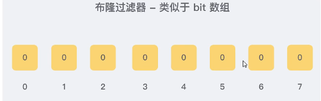
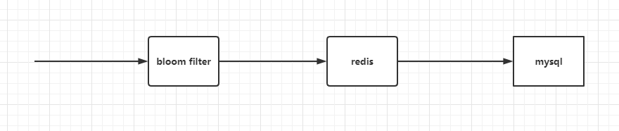
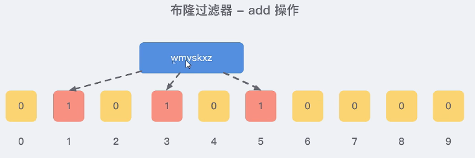
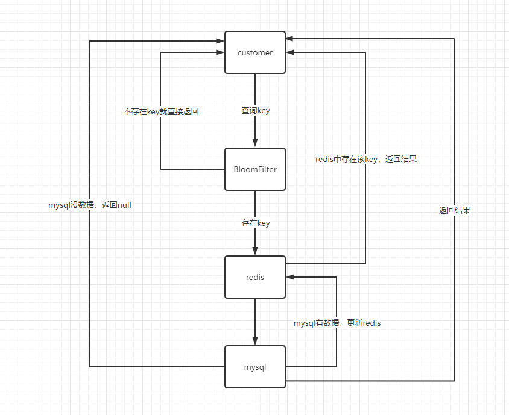

Bloom Filter，1970年提出  
实际上是一个很长的二进制数组+一系列随机hash算法映射函数，主要用于判断一个元素是否在集合中。  

Bitmap实际上是String类型，通过最小单位bit来进行0和1的设置，表示某个元素对应的值或者状态。  
一个bit的值，或者是0，或者是1  

redis字符串最大值为512M，所以bitmap最大值为4294967295 42亿

##### 使用场景：
1、用户在线状态
2、统计活跃用户
3、用户签到


类似于bit数组  
由一个初值都为0的bit数组和**多个哈希函数**构成，用来快速判断某个数据是否存在。  
类似set结构，不太准确。

hyperloglog 准确率0.81%  
布隆过滤器也是不太准确  

优点：高效的插入和查询，占用空间少，返回结果是不确定的。

**一个元素如果判断结果为存在的时候元素不一定存在，但是判断结果为不存在的时候则一定不存在**  

布隆过滤器可以添加元素，但是不能删除元素。因为删除元素会导致误判率增加。  
误判只能发生在过滤器没有添加过的元素，对于添加过的元素不会发生误判。  

**主要解决：缓存穿透的问题**  
查不存在的数据，一般是查redis，有就返回，没有就查数据库。当数据库也不存在这条数据的时候，每次查询都要访问数据库，这就是缓存穿透。  
缓存穿透的问题是，当有大量请求查询数据库不存在的数据时，就会给数据库带来压力，甚至会拖垮数据库。  

把已存在的key存在布隆过滤器，相当于redis前面挡着布隆过滤器。  

  

黑名单，识别垃圾邮件，只要是邮箱在黑名单中的邮件，就识别为垃圾邮件。  
把所有黑名单都放在布隆过滤器中，在收到邮件时，判断邮件地址是否在布隆过滤器中即可。  

hash碰撞：hashMap，输入值不同，但是输出值相同index。  
一个hash函数，容易发生碰撞。所以redis里面多个hash函数。  

以下是java的hash冲突案例。  
```java
public static void main(String[] args) {
    Set<Integer> hashCodeSet = new HashSet<>();
    for (int i = 0; i < 2000000; i++) {
        int hashCode = new Object().hashCode();
        if (hashCodeSet.contains(hashCode)){
            System.out.println("出现了重复的hashcode："+hashCode+"\t 运行到"+i);
//                break;
        }
        hashCodeSet.add(hashCode);
    }
    }
```  

布隆过滤器可以添加元素，不能删除元素，原因：  

###### 添加key时
使用多个hash函数对key进行hash运算得到一个整数索引值，对位数组长度进行取模运算得到一个位置，每个hash函数都会得到一个不同的位置，将这几个位置都置1就完成了add操作。

###### 查询key时
只要有其中一位是0，就表示这个key不存在，但如果都是1，则不一定存在对应的key。  
结论：
有，可能有
无，肯定无

但是当你删除1的时候，可能别的key也映射了这个index的1。那就把别的key直接毁掉了。  
例如，我们添加一个字符串wmyskxz  

  

当实际元素数量超过初始化数量时，应该对布隆过滤器进行重建，重新分配一个size更大的容器，再将所有的历史元素批量add进行。  

布隆过滤器的应用：谷歌的Guava解决缓存穿透、Redis布隆过滤器  

  
让过滤器作白名单使用：

白名单里面有的才让通过，没有直接返回，但是存在误判，由于判断率很小，1%的打到mysql，可以接受  

所有key都需要往redis和bloomfilter里面放入。    

引入redission