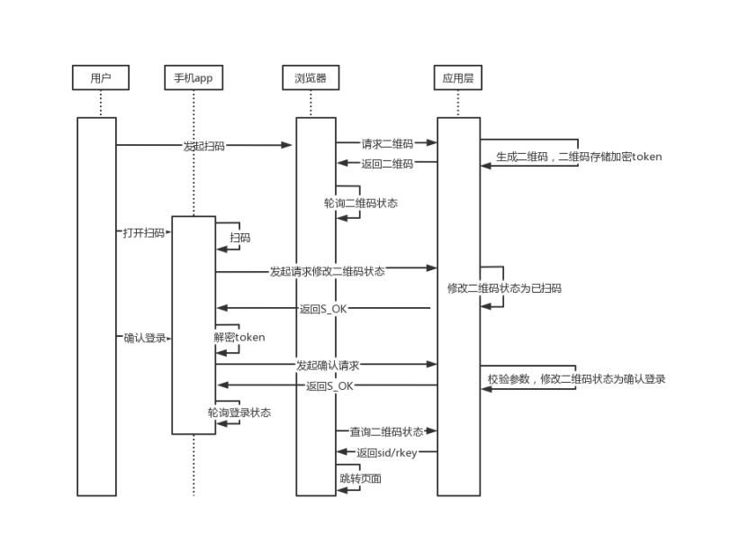

用户在浏览器上，点击button，去请求获取二维码。应用层根据UUID使用AES加密生成token，存在redis【setex】设置一段时间过期

如果用户长时间不扫码，浏览器去轮训二维码状态，会获取到二维码失效，提示点击更新二维码

如果用户使用手机APP扫码，携带用户信息去修改二维码状态为已扫码。（AES解密token，发起确认请求，返回S_OK）。并且不断的轮训登录状态，手机界面跳转登录成功界面。

这时浏览器还是在轮训二维码状态。已扫码之后，应用层返回sid，rmkey。浏览器跳转首页。